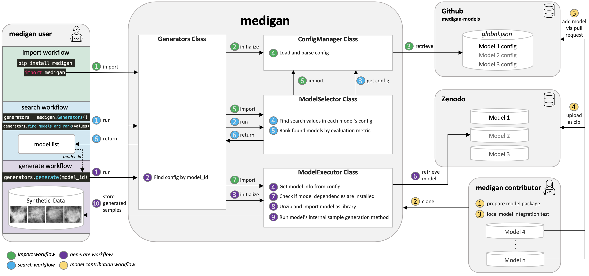

# WELCOME TO MEDIGAN

#### medigan - A Modular Python Library For Automating Synthetic Dataset Generation.

While being extendable to any modality and generative model, medigan focuses on automating medical image dataset synthesis using GANs for training deep learning models.

### Documentation
Link to Documentation: https://medigan.readthedocs.io/en/latest/

### Generative Models
The metadata and links to the models in medigan are stored in: https://github.com/RichardObi/medigan-models

### Architectural Overview



### Usage & Core Features:

    - Researchers and ML-practitioners can conveniently use an existing model in `medigan` for synthetic data augmentation instead of having to train their own generative model each time.

    - Users can search and find a model using search terms (e.g. "Mammography, 128x128, DCGAN") or key value pairs (e.g. `key` = "modality", `value` = "Mammography")

    - Users can explore the config and information (metrics, use-cases, modalities, etc) of each model in `medigan`

    - Users can generate samples using a model

    - Users can also get the generate_method of a model that they may want to use dynamically inside their dataloaders

### How to Add New Models to medigan:

    - `medigan` motivates the reuse of trained generative models.

    - Models can be added via pull request by adding a model to the config in https://github.com/RichardObi/medigan-models (link stored in `medigan.constants.CONFIG_FILE_URL`).

    - Model contributors need to specify a link to their model package in the config. We recommend to host and link model packages on Zenodo. Reasons:

        - Zenodo model packages get a static DOI. This provides clarity as to who the contributors and IP owners of each generative model in `medigan` are.

        - File modification/updates under the same DOI are not possible in Zenodo. This helps to avoid security issues as package content remains static after the model is tested, verified, and added to `medigan`.

        - Examples of how `medigan` model packages should be hosted on Zenodo can be found here: https://doi.org/10.5281/zenodo.5187715 and here: https://doi.org/10.5281/zenodo.5188558


### Example code snippets

```python
pip install medigan
```

```python
# import medigan and initialize Generators
from medigan import Generators
generators = Generators()
```

```python
# generate 10 samples using one of the medigan models
generators.generate(model_id="00001_DCGAN_MMG_CALC_ROI",
                    num_samples=10)
```

```python
# get the model's generate method and run it to generate 3 samples
gen_function = generators.get_generate_function(model_id="00001_DCGAN_MMG_CALC_ROI", 
                                                num_samples=3)
gen_function()
```

```python
# create a list of search terms and find the models that have these terms in their config.
values_list = ['dcgan', 'Mammography', 'inbreast']
models = generators.find_matching_models_by_values(values=values_list, 
                                                    target_values_operator='AND', 
                                                    are_keys_also_matched=True, 
                                                    is_case_sensitive=False)
print(f'Found models: {models}')
```

```python
# create a list of search terms, find a model and generate
values_list = ['dcgan', 'mMg', 'ClF', 'modalities', 'inbreast']
generators.find_model_and_generate(values=values_list, 
                                    target_values_operator='AND', 
                                    are_keys_also_matched=True, 
                                    is_case_sensitive=False, 
                                    num_samples=5)
```

```python
# rank the models by a performance metric and return ranked list of models
ranked_models = generators.rank_models_by_performance(metric="SSIM", 
                                                        order="asc")
print(ranked_models)
```

```python
# find the models, then rank them by a performance metric and return ranked list of models
ranked_models = generators.find_models_and_rank(values=values_list, 
                                                target_values_operator='AND',
                                                are_keys_also_matched=True,
                                                is_case_sensitive=False, 
                                                metric="SSIM", 
                                                order="asc")
print(ranked_models)
```

```python
# find the models, then rank them, and then generate samples with the best ranked model.
generators.find_models_rank_and_generate(values=values_list, 
                                        target_values_operator='AND',
                                        are_keys_also_matched=True,
                                        is_case_sensitive=False, 
                                        metric="SSIM", 
                                        order="asc", 
                                        num_samples=5)
```

```python
# find all models that contain a specific key-value pair in their model config.
key = "modality"
value = "Full-Field Mammography"
found_models = generators.get_models_by_key_value_pair(key1=key, 
                                                        value1=value, 
                                                        is_case_sensitive=False)
print(found_models)
```
