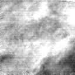
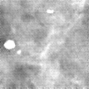
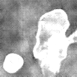
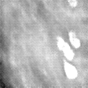

<!-- # MEDIGAN -->
<!--  -->


[](https://badge.fury.io/py/medigan)
[](https://img.shields.io/pypi/dm/medigan)

#### MEDIGAN - A Modular Python Library For Automating Synthetic Dataset Generation.

While being extendable to any modality and generative model, medigan focuses on automating medical image dataset synthesis using GANs for training deep learning models.

## Features:

- Researchers and ML-practitioners can conveniently use an existing model in `medigan` for synthetic data augmentation instead of having to train their own generative model each time.

- Search and find a model using search terms (e.g. "Mammography, 128x128, DCGAN") or key value pairs (e.g. `key` = "modality", `value` = "Mammography")

- Explore the config and information (metrics, use-cases, modalities, etc) of each model in `medigan`

- Generate samples using a model

- Get the generate_method of a model to use dynamically inside your app

## Available models

| Type                        | Modality |     Model     |   Size   | Base dataset | Sample |
|-----------------------------|:--------:|:-------------:|:--------:|:------------:|:------:|
| Breast Calcification        |   x-ray  |     dcgan     |  128x128 |   Inbreast   |        |
| Breast Mass                 |   x-ray  |     dcgan     |  128x128 |    Optimam   |        |
| Breast Density transfer     |   x-ray  |    cyclegan   | 1332x800 |     BCDR     |        |
| Breast Mask to mass         |   x-ray  |    pix2pix    |  256x256 |     BCDR     |        |
| Spine Bone cement injection |    CT    | inpaint_model |  128x128 |     VerSe    |        |

The metadata and links to the models in medigan are stored in: https://github.com/RichardObi/medigan-models

## Installation
To install the current release, simply run:
```python
pip install medigan
```

## Getting Started
Examples and notebooks are located at [examples](examples) folder

Documentation is available at [medigan.readthedocs.io](https://medigan.readthedocs.io/en/latest/)


### Generation example
Create mammography calcification images using dcgan model
```python
# import medigan and initialize Generators
from medigan import Generators
generators = Generators()

# generate 10 samples using one of the medigan models
generators.generate(model_id="00001_DCGAN_MMG_CALC_ROI", num_samples=10)
```






## Contributing
We welcome contributions to medigan. Please read the [contributing guidelines](CONTRIBUTING.md) on how to contribute to medigan project.