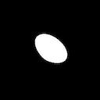
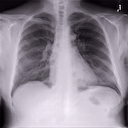

<!-- # MEDIGAN -->
<!--  -->


[](https://badge.fury.io/py/medigan)
[](https://doi.org/10.5281/zenodo.6327625)

## A modular package for automated synthetic data generation.

- :x: **Problem 1:** Data scarcity in medical imaging. 

- :x: **Problem 2:** Scarcity of readily reusable generative models in medical imaging.

- :white_check_mark: **Solution:** `medigan`
    1. dataset sharing via generative models :gift:
    2. data augmentation :gift:
    3. domain adaptation :gift:
    4. synthetic data evaluation method testing with multi-model datasets :gift:

`medigan` provides functions for sharing and re-use of pretrained generative models in medical imaging.

## Features:

- Instead of training your own, use one a generative models from `medigan` to generate synthetic data.

- Search and find a model in `medigan` using search terms (e.g. "Mammography" or "Endoscopy").

- Contribute your own generative model to `medigan` to increase its visibility, re-use, and impact.

## Available models

| Output type                     | Modality |      Model type    |   Output size   | Base dataset |     Output examples      |    `model_id`     |  Hosted on  |  Reference |
|-----------------------------|:--------:|:-------------:|:--------:|:------------:|:------:|:------:|:------:|:------:|
| <sub> Breast Calcification        </sub> | <sub>  mammography  </sub> | <sub>    dcgan     </sub> | <sub> 128x128 </sub> | <sub>  [Inbreast](https://www.academicradiology.org/article/S1076-6332(11)00451-X/fulltext)   </sub> |  | <sub> `00001_DCGAN_MMG_CALC_ROI` </sub> | <sub>[Zenodo (5187714)](https://doi.org/10.5281/zenodo.5187714) </sub> | | 
| <sub> Breast Mass                 </sub> | <sub>  mammography  </sub> | <sub>    dcgan     </sub> | <sub> 128x128 </sub> | <sub>   [Optimam](https://doi.org/10.48550/arXiv.2004.04742)   </sub> |  | <sub> `00002_DCGAN_MMG_MASS_ROI` </sub> | <sub>[Zenodo (5188557)](https://doi.org/10.5281/zenodo.5188557) </sub> | <sub>[Alyafi et al (2019)](https://doi.org/10.48550/arXiv.1909.02062) </sub> | 
| <sub> Breast Density Transfer     </sub> | <sub>  mammography  </sub> | <sub>   cyclegan   </sub> | <sub>1332x800 </sub> | <sub>    [BCDR](https://bcdr.eu/information/about)     </sub> |  | <sub> `00003_CYCLEGAN_MMG_DENSITY_FULL` </sub> | <sub>[Zenodo (5547263)](https://doi.org/10.5281/zenodo.5547263) </sub> | | 
| <sub> Breast Mass with Mask       </sub> | <sub>  mammography  </sub> | <sub>   pix2pix    </sub> | <sub> 256x256 </sub> | <sub>    [BCDR](https://bcdr.eu/information/about)     </sub> |  <br>  | <sub><sub> `00004_PIX2PIX_MMG_MASSES_W_MASKS` </sub></sub> | <sub>[Zenodo (7093759)](https://doi.org/10.5281/zenodo.7093759) </sub> |  | 
| <sub> Breast Mass                 </sub> | <sub>  mammography  </sub> | <sub>    dcgan     </sub> | <sub> 128x128 </sub> | <sub>    [BCDR](https://bcdr.eu/information/about)     </sub> |  | <sub> `00005_DCGAN_MMG_MASS_ROI` </sub> | <sub>[Zenodo (6555188)](https://doi.org/10.5281/zenodo.6555188) </sub> | <sub>[Szafranowska et al (2022)](https://doi.org/10.48550/arXiv.2203.04961) </sub> | 
| <sub> Breast Mass                 </sub> | <sub>  mammography  </sub> | <sub>   wgan-gp    </sub> | <sub> 128x128 </sub> | <sub>    [BCDR](https://bcdr.eu/information/about)     </sub> |  | <sub> `00006_WGANGP_MMG_MASS_ROI` </sub> | <sub>[Zenodo (6554713)](https://doi.org/10.5281/zenodo.6554713) </sub> | <sub>[Szafranowska et al (2022)](https://doi.org/10.48550/arXiv.2203.04961) </sub> | 
| <sub> Brain Tumors on Flair, T1, T1c, T2 with Masks  </sub> | <sub>  brain MRI  </sub> | <sub>   inpaint GAN    </sub> | <sub> 256x256 </sub> | <sub>    [BRATS 2018](https://wiki.cancerimagingarchive.net/pages/viewpage.action?pageId=37224922)     </sub> |  <br>  <br>  <br>  <br>  <br>  | <sub> `00007_INPAINT_BRAIN_MRI` </sub> | <sub> [Zenodo (7041737)](https://doi.org/10.5281/zenodo.7041737) </sub> | <sub>[Kim et al (2020)](https://doi.org/10.1002/mp.14701) </sub> | 
| <sub> Breast Mass (Mal/Benign)    </sub> | <sub>  mammography  </sub> | <sub>   c-dcgan     </sub> | <sub> 128x128 </sub> | <sub>    [CBIS-DDSM](https://wiki.cancerimagingarchive.net/display/Public/CBIS-DDSM)     </sub> |  | <sub> `00008_C-DCGAN_MMG_MASSES` </sub> | <sub>[Zenodo (6647349)](https://doi.org/10.5281/zenodo.6647349) </sub> | |  
| <sub> Polyp with Mask             </sub> | <sub>  endoscopy  </sub> | <sub>   pggan   </sub> | <sub> 256x256 </sub> | <sub>    [HyperKvasir](https://osf.io/mh9sj/)     </sub> |  <br>  | <sub> `00009_PGGAN_POLYP_PATCHES_W_MASKS` </sub> | <sub>[Zenodo (6653743)](https://doi.org/10.5281/zenodo.6653743) </sub> | <sub>[Thambawita et al (2022)](https://doi.org/10.1371/journal.pone.0267976) </sub> | 
| <sub> Polyp with Mask             </sub> | <sub>  endoscopy  </sub> | <sub>   fastgan </sub> | <sub> 256x256 </sub> | <sub>    [HyperKvasir](https://osf.io/mh9sj/)     </sub> |  <br>  | <sub> `00010_FASTGAN_POLYP_PATCHES_W_MASKS` </sub> | <sub>[Zenodo (6660711)](https://doi.org/10.5281/zenodo.6660711) </sub> | <sub>[Thambawita et al (2022)](https://doi.org/10.1371/journal.pone.0267976) </sub> | 
| <sub> Polyp with Mask             </sub> | <sub>  endoscopy  </sub> | <sub>   singan </sub> | <sub> ≈250x250 </sub> | <sub>    [HyperKvasir](https://osf.io/mh9sj/)     </sub> |  <br>  | <sub> `00011_SINGAN_POLYP_PATCHES_W_MASKS` </sub> | <sub>[Zenodo (6667944)](https://doi.org/10.5281/zenodo.6667944) </sub> | <sub>[Thambawita et al (2022)](https://doi.org/10.1371/journal.pone.0267976) </sub> | 
| <sub> Breast Mass (Mal/Benign)    </sub> | <sub>  mammography  </sub> | <sub>   c-dcgan     </sub> | <sub> 128x128 </sub> | <sub>    [BCDR](https://bcdr.eu/information/about)     </sub> |  | <sub> `00012_C-DCGAN_MMG_MASSES` </sub> | <sub>[Zenodo (6755693)](https://doi.org/10.5281/zenodo.6818095) </sub> | | 
| <sub> Breast Density Transfer MLO </sub> | <sub>  mammography  </sub> | <sub>   cyclegan   </sub> | <sub>1332x800 </sub> | <sub>    [OPTIMAM](https://doi.org/10.48550/arXiv.2004.04742)     </sub> |  | <sub> `00013_CYCLEGAN_MMG_DENSITY_OPTIMAM_MLO` </sub> | <sub>[Zenodo (6818095)](https://doi.org/10.5281/zenodo.6818095) </sub> | | 
| <sub> Breast Density Transfer CC  </sub> | <sub>  mammography  </sub> | <sub>   cyclegan   </sub> | <sub>1332x800 </sub> | <sub>    [OPTIMAM](https://doi.org/10.48550/arXiv.2004.04742)     </sub> |  | <sub> `00014_CYCLEGAN_MMG_DENSITY_OPTIMAM_CC` </sub> | <sub>[Zenodo (6818103)](https://doi.org/10.5281/zenodo.6818103) </sub> | |  
| <sub> Breast Density Transfer MLO </sub> | <sub>  mammography  </sub> | <sub>   cyclegan   </sub> | <sub>1332x800 </sub> | <sub>    [CSAW](https://link.springer.com/article/10.1007/s10278-019-00278-0)     </sub> |  | <sub> `00015_CYCLEGAN_MMG_DENSITY_CSAW_MLO` </sub> | <sub>[Zenodo (6818105)](https://doi.org/10.5281/zenodo.6818105) </sub> | |  
| <sub> Breast Density Transfer CC  </sub> | <sub>  mammography  </sub> | <sub>   cyclegan   </sub> | <sub>1332x800 </sub> | <sub>    [CSAW](https://link.springer.com/article/10.1007/s10278-019-00278-0)    </sub> |  | <sub> `00016_CYCLEGAN_MMG_DENSITY_CSAW_CC` </sub> | <sub>[Zenodo (6818107)](https://doi.org/10.5281/zenodo.6818107) </sub> | | 
| <sub> Lung Nodules                </sub> | <sub>  chest x-ray  </sub> | <sub>   dcgan      </sub> | <sub>128x128  </sub> | <sub>    [NODE21](https://zenodo.org/record/4725881#.YxNmNuxBwXA)     </sub> |  | <sub> `00017_DCGAN_XRAY_LUNG_NODULES` </sub> | <sub>[Zenodo (6943691)](https://doi.org/10.5281/zenodo.6943691) </sub> | | 
| <sub> Lung Nodules                </sub> | <sub>  chest x-ray  </sub> | <sub>   wgan-gp      </sub> | <sub>128x128  </sub> | <sub>    [NODE21](https://zenodo.org/record/4725881#.YxNmNuxBwXA)     </sub> |  | <sub> `00018_WGANGP_XRAY_LUNG_NODULES` </sub> | <sub>[Zenodo (6943761)](https://doi.org/10.5281/zenodo.6943761) </sub> | | 
| <sub> Chest Xray Images           </sub> | <sub>  chest x-ray  </sub> | <sub>   pggan      </sub> | <sub>1024x1024  </sub> | <sub>    [ChestX-ray14](https://nihcc.app.box.com/v/ChestXray-NIHCC/folder/36938765345)     </sub> |  | <sub> `00019_PGGAN_CHEST_XRAY` </sub> | <sub>[Zenodo (6943803)](https://doi.org/10.5281/zenodo.6943803) </sub> | | 
| <sub> Chest Xray Images           </sub> | <sub>  chest x-ray  </sub> | <sub>   pggan      </sub> | <sub>1024x1024  </sub> | <sub>    [ChestX-ray14](https://nihcc.app.box.com/v/ChestXray-NIHCC/folder/36938765345)     </sub> |  | <sub> `00020_PGGAN_CHEST_XRAY` </sub> | <sub>[Zenodo (7046280)](https://doi.org/10.5281/zenodo.7046280) </sub> | <sub> [Segal et al (2021)](https://doi.org/10.1007/s42979-021-00720-7) </sub> |
| <sub> Brain T1-T2 MRI Modality Transfer </sub> | <sub>  brain MRI  </sub> | <sub>   cyclegan      </sub> | <sub>224x192  </sub> | <sub>    [CrossMoDA 2021](https://arxiv.org/abs/2201.02831)     </sub> |  | <sub> `00021_CYCLEGAN_BRAIN_MRI_T1_T2` </sub> | <sub>[Zenodo (7074555)](https://doi.org/10.5281/zenodo.7074555) </sub> | <sub> [Joshi et al (2022)](https://doi.org/10.1007/978-3-031-09002-8_47) </sub> |

Model information can be found in the [model documentation](https://medigan.readthedocs.io/en/latest/models.html) and in the [global.json](https://github.com/RichardObi/medigan/blob/main/config/global.json) model metadata.

## Installation
To install the current release, simply run:
```python
pip install medigan
```

## Getting Started
Examples and notebooks are located at [examples](examples) folder

Documentation is available at [medigan.readthedocs.io](https://medigan.readthedocs.io/en/latest/)


### Generation example
#### DCGAN 
Create mammography calcification images using DCGAN model
```python
# import medigan and initialize Generators
from medigan import Generators
generators = Generators()

# generate 6 samples with model 1 (00001_DCGAN_MMG_CALC_ROI). 
# Also, auto-install required model dependencies.
generators.generate(model_id=1, num_samples=6, install_dependencies=True)
```


#### CYCLEGAN 
Create mammograms translated from Low-to-High Breast Density using CYCLEGAN model
```python
from medigan import Generators
generators = Generators()
# model 3 is "00003_CYCLEGAN_MMG_DENSITY_FULL"
generators.generate(model_id=3, num_samples=1)
```

&rarr;


### Search Example
Search for a [model](https://medigan.readthedocs.io/en/latest/models.html) inside medigan using keywords
```python
# import medigan and initialize Generators
from medigan import Generators
generators = Generators()

# list all models
print(generators.list_models())

# search for models that have specific keywords in their config
keywords = ['DCGAN', 'Mammography', 'BCDR']
results = generators.find_matching_models_by_values(keywords)
```

### Get Model as Dataloader 
We can directly receive a [torch.utils.data.DataLoader](https://pytorch.org/docs/stable/data.html#torch.utils.data.DataLoader) object for any of medigan's generative models.
```python
from medigan import Generators
generators = Generators()
# model 4 is "00004_PIX2PIX_MMG_MASSES_W_MASKS"
dataloader = generators.get_as_torch_dataloader(model_id=4, num_samples=3)
```

Visualize the contents of the dataloader.
```python
from matplotlib import pyplot as plt
import numpy as np

plt.figure()
# subplot with 2 rows and len(dataloader) columns
f, img_array = plt.subplots(2, len(dataloader)) 

for batch_idx, data_dict in enumerate(dataloader):
    sample = np.squeeze(data_dict.get("sample"))
    mask = np.squeeze(data_dict.get("mask"))
    img_array[0][batch_idx].imshow(sample, interpolation='nearest', cmap='gray')
    img_array[1][batch_idx].imshow(mask, interpolation='nearest', cmap='gray')
plt.show()
```


## Visualize A Model 
With our interface, it is possible to generate sample by manually setting the conditional inputs or latent vector values. The sample is updated in realtime, so it's possible to observe how the images changes when the parameters are modified. The visualization is available only for models with accessible input latent vector. Depending on a model, a conditional input may be also available or synthetic segmentation mask.
```
from medigan import Generators

generators = Generators()
# model 10 is "00010_FASTGAN_POLYP_PATCHES_W_MASKS"
generators.visualize(10)
```


## Contribute A Model

Create an [__init__.py](templates/examples/__init__.py) file in your model's root folder. 

Next, run the following code to contribute your model to medigan.

- Your model will be stored on [Zenodo](https://zenodo.org/). 

- Also, a Github [issue](https://github.com/RichardObi/medigan/issues) will be created to add your model's metadata to medigan's [global.json](https://github.com/RichardObi/medigan/blob/main/config/global.json).

- To do so, please provide a github access token ([get one here](https://github.com/settings/tokens)) and a zenodo access token ([get one here](https://zenodo.org/account/settings/applications/tokens/new/)), as shown below. After creation, the zenodo access token may take a few minutes before being recognized in zenodo API calls.

```python
from medigan import Generators
generators = Generators()

# Contribute your model
generators.contribute(
    model_id = "00100_YOUR_MODEL", # assign an ID
    init_py_path ="path/ending/with/__init__.py",
    model_weights_name = "10000",
    model_weights_extension = ".pt",
    generate_method_name = "generate", # in __init__.py
    dependencies = ["numpy", "torch"], 
    creator_name = "YOUR_NAME",
    creator_affiliation = "YOUR_AFFILIATION",
    zenodo_access_token = 'ZENODO_ACCESS_TOKEN',
    github_access_token = 'GITHUB_ACCESS_TOKEN',
```
Thank you for your contribution! 

You will soon receive a reply in the Github [issue](https://github.com/RichardObi/medigan/issues) that you created for your model by running ```generators.contribute()```.

## Contributions in General
We welcome contributions to medigan. Please send us an email or read the [contributing guidelines](CONTRIBUTING.md) regarding contributing to the medigan project.