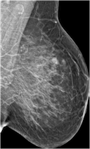
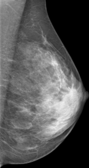
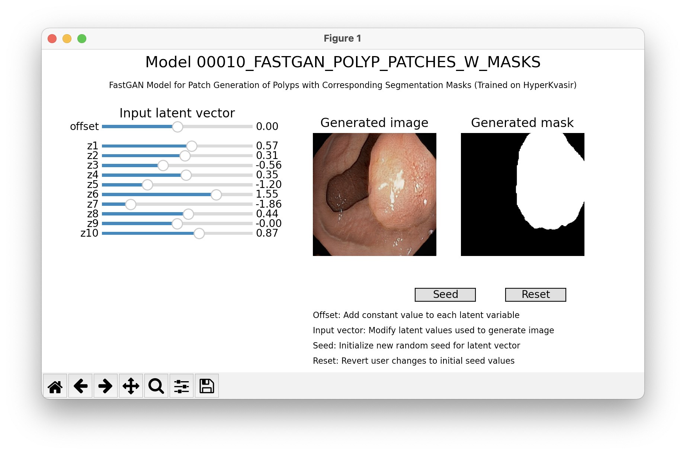

<!-- # MEDIGAN -->
<!--  -->


[](https://badge.fury.io/py/medigan)
[](https://doi.org/10.5281/zenodo.6327625)

#### MEDIGAN - A Modular Python Library For Automating Synthetic Dataset Generation.

While being extendable to any modality and generative model, medigan focuses on automating medical image dataset synthesis using GANs for training deep learning models.

## Features:

- Researchers and ML-practitioners can conveniently use an existing model in `medigan` for synthetic data augmentation instead of having to train their own generative model each time.

- Search and find a model using search terms (e.g. "Mammography, 128x128, DCGAN") or key value pairs (e.g. `key` = "modality", `value` = "Mammography")

- Explore the config and information (metrics, use-cases, modalities, etc) of each model in `medigan`

- Generate samples using a model

- Get the generate_method of a model to use dynamically inside your app

## Available models

| Output                       | Modality |     Model     |   Size   | Base dataset | Sample  |  ID   |
|-----------------------------|:--------:|:-------------:|:--------:|:------------:|:------:|:------:|
| Breast Calcification        |   x-ray  |     dcgan     |  128x128 |   Inbreast   |   | <sub> 00001_DCGAN_MMG_CALC_ROI </sub>  | 
| Breast Mass                 |   x-ray  |     dcgan     |  128x128 |    Optimam   |   | <sub> 00002_DCGAN_MMG_MASS_ROI </sub>         |
| Breast Density Transfer     |   x-ray  |    cyclegan   | 1332x800 |     BCDR     |   | <sub> 00003_CYCLEGAN_MMG_DENSITY_FULL </sub>  |
| Breast Mass with Mask       |   x-ray  |    pix2pix    |  256x256 |     BCDR     |    | <sub> 00004_PIX2PIX_MASKTOMASS_BREAST_MG_SYNTHESIS </sub> |
| Breast Mass                 |   x-ray  |     dcgan     |  128x128 |     BCDR     |   | <sub> 00005_DCGAN_MMG_MASS_ROI </sub>         | 
| Breast Mass                 |   x-ray  |    wgan-gp    |  128x128 |     BCDR     |   | <sub> 00006_WGANGP_MMG_MASS_ROI </sub>        | 
| Tumor Mask                  |   x-ray  |    bezier curves    |  256x256 |     BCDR     |   | <sub> 00007_BEZIERCURVE_TUMOUR_MASK </sub>        | 
| Breast Mass (Mal/Benign)    |   x-ray  |    c-dcgan     |  128x128 |     CBIS-DDSM     |   | <sub> 00008_C-DCGAN_MMG_MASSES </sub>        | 
| Polyp with Mask             |   endoscopy  |    pggan   |  256x256 |     HyperKvasir     |   | <sub> 00009_PGGAN_POLYP_PATCHES_W_MASKS </sub>        | 
| Polyp with Mask             |   endoscopy  |    fastgan |  256x256 |     HyperKvasir     |   | <sub> 00010_FASTGAN_POLYP_PATCHES_W_MASKS </sub>      | 
| Polyp with Mask             |   endoscopy  |    singan |  250x??? |     HyperKvasir     |   | <sub> 00011_SINGAN_POLYP_PATCHES_W_MASKS </sub>      | 

[comment]: <> (| Spine Bone Cement Injection |    CT    |    biceps     |  128x128 |     VerSe    | <sub> to be announced </sub>                  |        |)

The metadata and links to the models in medigan are stored in: https://github.com/RichardObi/medigan-models

## Installation
To install the current release, simply run:
```python
pip install medigan
```

## Getting Started
Examples and notebooks are located at [examples](examples) folder

Documentation is available at [medigan.readthedocs.io](https://medigan.readthedocs.io/en/latest/)


### Generation example
#### DCGAN 
Create mammography calcification images using DCGAN model
```python
# import medigan and initialize Generators
from medigan import Generators
generators = Generators()

# generate 6 samples using one of the medigan models
generators.generate(model_id="00001_DCGAN_MMG_CALC_ROI", num_samples=6)
```


#### CYCLEGAN 
Create mammograms translated from Low-to-High Breast Density using CYCLEGAN model
```python
from medigan import Generators
generators = Generators()

generators.generate(model_id="00003_CYCLEGAN_MMG_DENSITY_FULL", num_samples=1)
```

&rarr;



### Search Example
Search for a model inside medigan using keywords
```python
# import medigan and initialize Generators
from medigan import Generators
generators = Generators()

# list all models
print(generators.list_models())

# search for models that have specific keywords in their config
keywords = ['DCGAN', 'Mammography', 'BCDR']
results = generators.find_matching_models_by_values(keywords)
```

### Get Model as Dataloader 
We can directly receive a [torch.utils.data.DataLoader](https://pytorch.org/docs/stable/data.html#torch.utils.data.DataLoader) object for any of medigan's generative models.
```python
from medigan import Generators
generators = Generators()
dataloader = generators.get_as_torch_dataloader(model_id="00004_PIX2PIX_MASKTOMASS_BREAST_MG_SYNTHESIS", num_samples=3)
```

Visualize the contents of the dataloader.
```python
from matplotlib import pyplot as plt
import numpy as np

plt.figure()
# subplot with 2 rows and len(dataloader) columns
f, img_array = plt.subplots(2, len(dataloader)) 

for batch_idx, data_dict in enumerate(dataloader):
    sample = np.squeeze(data_dict.get("sample"))
    mask = np.squeeze(data_dict.get("mask"))
    img_array[0][batch_idx].imshow(sample, interpolation='nearest', cmap='gray')
    img_array[1][batch_idx].imshow(mask, interpolation='nearest', cmap='gray')
plt.show()
```


## Interface for custom generation
It is possible to generate sample by manually setting the conditional inputs or latent vector values. The sample is updated in realtime, so it's possible to observe how the images changes when the parameters are modified. The visualization is avaialble only for models with accessible input latent vector. Depending on a model, a conditional input may be also available or synthetic segmentation mask.
```
from medigan import Generators

generators = Generators()
generators.visualize("00010_FASTGAN_POLYP_PATCHES_W_MASKS")
```



## Contribute A Model

Create an [__init__.py](templates/examples/__init__.py) file in your model's root folder. 

Next, run the following code to contribute your model to medigan.

- Your model will be stored on [Zenodo](https://zenodo.org/). 

- Also, a Github [issue](https://github.com/RichardObi/medigan/issues) will be created to add your model's metadata to medigan's [global.json](https://github.com/RichardObi/medigan/blob/main/config/global.json).

- To do so, please provide a github access token ([get one here](https://github.com/settings/tokens)) and a zenodo access token ([get one here](https://zenodo.org/account/settings/applications/tokens/new/)), as shown below.

```python
from medigan import Generators
generators = Generators()

# Contribute your model
generators.contribute(
    model_id = "00100_YOUR_MODEL", # assign an ID
    init_py_path ="path/ending/with/__init__.py",
    model_weights_name = "10000",
    model_weights_extension = ".pt",
    generate_method_name = "generate", # in __init__.py
    dependencies = ["numpy", "torch"], 
    creator_name = "YOUR_NAME",
    creator_affiliation = "YOUR_AFFILIATION",
    zenodo_access_token = 'ZENODO_ACCESS_TOKEN',
    github_access_token = 'GITHUB_ACCESS_TOKEN',
```
Thank you for your contribution! 

You will soon receive a reply in the Github [issue](https://github.com/RichardObi/medigan/issues) that you created for your model by running ```generators.contribute()```.

## Contributions in General
We welcome contributions to medigan. Please send us an email or read the [contributing guidelines](CONTRIBUTING.md) regarding contributing to the medigan project.