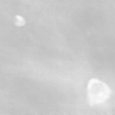

<!-- # MEDIGAN -->
<!--  -->


[](https://badge.fury.io/py/medigan)
[](https://img.shields.io/pypi/dm/medigan)
[](https://doi.org/10.5281/zenodo.6327625)


#### MEDIGAN - A Modular Python Library For Automating Synthetic Dataset Generation.

While being extendable to any modality and generative model, medigan focuses on automating medical image dataset synthesis using GANs for training deep learning models.

## Features:

- Researchers and ML-practitioners can conveniently use an existing model in `medigan` for synthetic data augmentation instead of having to train their own generative model each time.

- Search and find a model using search terms (e.g. "Mammography, 128x128, DCGAN") or key value pairs (e.g. `key` = "modality", `value` = "Mammography")

- Explore the config and information (metrics, use-cases, modalities, etc) of each model in `medigan`

- Generate samples using a model

- Get the generate_method of a model to use dynamically inside your app

## Available models

| Type                        | Modality |     Model     |   Size   | Base dataset | Sample  |  ID   |
|-----------------------------|:--------:|:-------------:|:--------:|:------------:|:------:|:------:|
| Breast Calcification        |   x-ray  |     dcgan     |  128x128 |   Inbreast   |   | <sub> 00001_DCGAN_MMG_CALC_ROI </sub>  | 
| Breast Mass                 |   x-ray  |     dcgan     |  128x128 |    Optimam   |   | <sub> 00002_DCGAN_MMG_MASS_ROI </sub>         |
| Breast Density Transfer     |   x-ray  |    cyclegan   | 1332x800 |     BCDR     |   | <sub> 00003_CYCLEGAN_MMG_DENSITY_FULL </sub>  |
| Breast Mask to Mass         |   x-ray  |    pix2pix    |  256x256 |     BCDR     |   | <sub> 00004_PIX2PIX_MASKTOMASS_BREAST_MG_SYNTHESIS </sub> |
| Breast Mass                 |   x-ray  |     dcgan     |  128x128 |     BCDR     |   | <sub> 00005_DCGAN_MMG_MASS_ROI </sub>         | 
| Breast Mass                 |   x-ray  |    wgan-gp    |  128x128 |     BCDR     |   | <sub> 00006_WGANGP_MMG_MASS_ROI </sub>        | 

[comment]: <> (| Spine Bone Cement Injection |    CT    |    biceps     |  128x128 |     VerSe    | <sub> to be announced </sub>                  |        |)

The metadata and links to the models in medigan are stored in: https://github.com/RichardObi/medigan-models

## Installation
To install the current release, simply run:
```python
pip install medigan
```

## Getting Started
Examples and notebooks are located at [examples](examples) folder

Documentation is available at [medigan.readthedocs.io](https://medigan.readthedocs.io/en/latest/)


### Generation example
#### DCGAN 
Create mammography calcification images using DCGAN model
```python
# import medigan and initialize Generators
from medigan import Generators
generators = Generators()

# generate 6 samples using one of the medigan models
generators.generate(model_id="00001_DCGAN_MMG_CALC_ROI", num_samples=6)
```





#### CYCLEGAN 
Create mammograms translated from Low-to-High Breast Density using CYCLEGAN model
```python
from medigan import Generators
generators = Generators()

generators.generate(model_id="00003_CYCLEGAN_MMG_DENSITY_FULL", num_samples=1)
```

&rarr;


### Search Example
Search for a model inside medigan using keywords
```python
# import medigan and initialize Generators
from medigan import Generators
generators = Generators()

# list all models
print(generators.list_models())

# search for models that have specific keywords in their config
keywords = ['DCGAN', 'Mammography', 'BCDR']
results = generators.find_matching_models_by_values(keywords)
```

### Get Model as Dataloader 
We can directly receive a [torch.utils.data.DataLoader](https://pytorch.org/docs/stable/data.html#torch.utils.data.DataLoader) object for any of medigan's generative models.
```python
from medigan import Generators
generators = Generators()
dataloader = generators.get_as_torch_dataloader(model_id="00004_PIX2PIX_MASKTOMASS_BREAST_MG_SYNTHESIS", num_samples=3)
```

Visualize the contents of the dataloader.
```python
from matplotlib import pyplot as plt
import numpy as np

plt.figure()
# subplot with 2 rows and len(dataloader) columns
f, img_array = plt.subplots(2, len(dataloader)) 

for batch_idx, data_dict in enumerate(dataloader):
    sample = np.squeeze(data_dict.get("sample"))
    mask = np.squeeze(data_dict.get("mask"))
    img_array[0][batch_idx].imshow(sample, interpolation='nearest', cmap='gray')
    img_array[1][batch_idx].imshow(mask, interpolation='nearest', cmap='gray')
plt.show()
```


## Contribute A Model

Create an [__init__.py](templates/examples/__init__.py) file in your model's root folder. 

Next, run the following code to push your model to Zenodo.

```python
from medigan import Generators
generators = Generators()

# The model contributor handles 
generators.add_model_contributor(
        model_id="00010_YOUR_MODEL", 
        init_py_path="path/ending/with/__init__.py")

# Input some metadata information for your model.
generators.add_metadata_from_input(
        model_id="00010_YOUR_MODEL", 
        model_weights_name = "10000",
        model_weights_extension=".pt", 
        generate_method_name = "generate", 
        dependencies=["numpy", "torch"])

# Get Zenodo access token: https://zenodo.org/account/settings/applications/tokens/new/
generators.push_to_zenodo(
        model_id="00010_YOUR_MODEL",
        access_token="ACCESS_TOKEN",
        creator_name="NAME",
        creator_affiliation="AFFILIATION")
```

## Contributions in General
We welcome contributions to medigan. Please send us an email or read the [contributing guidelines](CONTRIBUTING.md) on how to contribute to the medigan project.