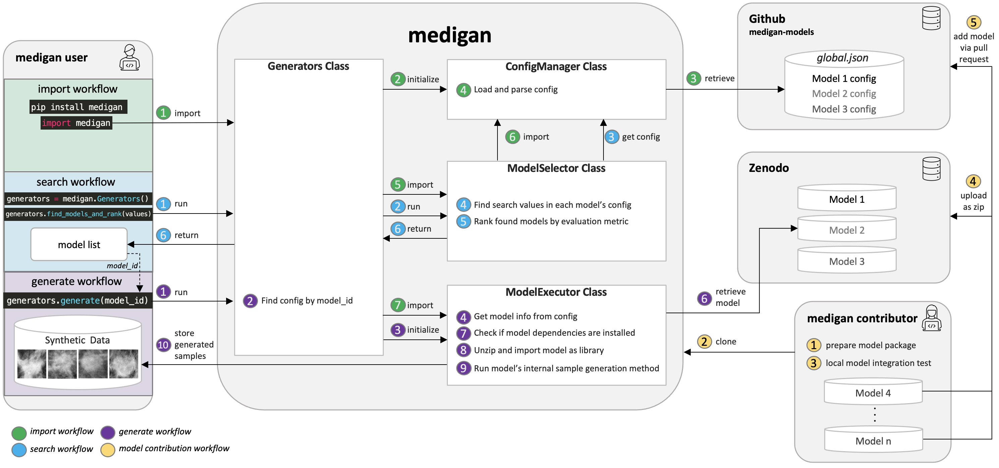

Model Contributions
=====================

We are happy that you are thinking of contributing your generative model to `medigan`.
This will make your model accessible to our user base and our users can easily integrate your models synthetic data in their model training pipelines and experiments.

Guide: How to add your model
____________________________
In the following, you find a step-by-step guide on how to contribute your generative model to `medigan`.
In case you encounter problems during this process feel free to reach out by creating an issue `here <https://github.com/RichardObi/medigan-models/issues>`_ and we will try to help.
Checkout the figure below that shows the main components of the model contribution workflow depicted in yellow (d).

   Architectural overview including main workflows consisting of (a) library import and initialisation, (b) generative model search and ranking, (c) sample generation, and (d) generative model contribution.

If you are here, you have recently developed a generative model such as a GAN or an Variational Autoencoder and you would like to boost your model's impact, reusability, dissemination by uploading it to `medigan`.
We are delighted and will assist you in adding your model.

#. **Firstly, let's create the needed files:**

    To add your model you will need the following files.

    #. A checkpoint file that contains your trained model weights (i.e. the ``state_dict`` in pytorch)

    #. An ``__init__.py`` file that contains functions that

        - loads the weights file (let's call that one ``weights.pt``)

        - initializes your model with these weights

        - generate samples with the initialized model.

    #. Now that you have the ``weights.pt`` and the ``__init__.py``, let's check if we can make them work together.

        #. Run your ``__init__.py``'s generate function using e.g. ``python -m __init__.py generate``

        #. Check whether your model did load the weights effectively and whether synthetic samples were generated as expected.

    #. Apply some necessary adjustments to your model package, particularly to your ``__init__.py``:

        #. We have some templates that you can use to guide the adjustments described below

            - If you are using a model that generates samples **without** image input (e.g., noise-to-image): Download Model `00002 <https://doi.org/10.5281/zenodo.5188557>`_ from `here <https://zenodo.org/record/5548158/files/MALIGN_DCGAN.zip?download=1>`_. Unzip it and open the ``__init__.py`` that contains an example ``generate()`` method.

            - If you are using a model that generates samples **with** image input (e.g., image-to-image): Download Model `00003 <https://doi.org/10.5281/zenodo.5547263>`_ from `here <https://zenodo.org/record/5555010/files/CycleGAN_high_density.zip?download=1>`_. Unzip it and open the ``__init__.py`` that contains an example ``generate()`` method.

        #. Please note that user's of `medigan` models may add your model to their preprocessing or AI training pipelines. Please make sure that your model, hence, runs efficiently. For instance, your model should load the weights only once even though the generate() function is called multiple times.

        #. Please make sure your model is able to run both on gpu and on cpu and your code automatically detects on which one to run.

        #. Please replace all ``print()`` functions from your code with ``logging.debug()`` (for this you need to ``import logging``).

        #. Please add appropriate error handling using ``try, except`` blocks on each possible source of error in your code. ``raise`` the error in your ``generate()`` function to allow `medigan` to handle it and pass it to the user.

        #. If your generative model needs some input images, provide a few example images in a folder called ``/images``. Users may test your model with these example images before feeding their own input images to your model.

        #. There are a few parameters of the ``generate()`` that are mandatory in `medigan` and others that you can set optionally.

            - Mandatory:
                - ``model_file``: string, the path where your ``generate()`` method will find its weight file
                - ``output_path``: string, the path where our ``generate()`` method should store the generated images
                - ``save_images``: boolean, whether your ``generate()`` method should store generated samples in ``output_path`` or return them as numpy arrays.
                - ``num_samples``: int, the number of samples that should be generated.

            - Optional:
                - ``input_path``: string, the path where our ``generate()`` method finds images that should be used as input into the generative model (i.e. in image-to-image translation).
                - ``image_size``: array, that contains image height, width, and, optionally, also depth.
                - ``translate_all_images``: boolean, in image-to-image translation, if ``True``, this overwrites the ``num_samples`` and instead translates all images found in ``input_path``.
                - ``gpu_id``: int, if a user has various GPUs available, the user can specify which one of them to use to run your generative model.

#. **Secondly, test your model locally:**
    Okay, now that we know which files we need, let's test them using a local version of `medigan`.

    #. Let's start by cloning `medigan` e.g. using the command line: ``git clone https://github.com/RichardObi/medigan.git``
    #. Next, cd into `medigan`, install the dependencies of `medigan`, and create a virtual environment.

        You can do so running these commands:

        - ``cd medigan``
        - ``pip install pipenv``
        - ``pipenv install``
        - ``pipenv shell``

    #. Now that you have your environment up and running, please run the following command to download the config file.

        - ``python -m tests.tests TestMediganMethods.test_init_generators``

    #. In the folder ``/config``, you should now see a file called `global.json <https://raw.githubusercontent.com/RichardObi/medigan-models/main/global.json>`_. In this file each model's metadata is stored.

        * Please add the metadata for your model at the bottom of the `global.json` file.
        * To add the metadata, you can use the metadata of model `00001 <https://doi.org/10.5281/zenodo.5187714>`_ in `global.json <https://raw.githubusercontent.com/RichardObi/medigan-models/main/global.json>`_ as example.
        * Copy the metadata of model 00001 and add it to the bottom of ``global.json``. Then adjust each entry in that part of the json so that it represents your own model.
            - The ``model_id`` should follow the convention ``NNNNN_TTTTTT_MMMM_AAAAA_GGGG`` (N = Number of model, T = Type of model, M = Modality, A = Anatomic/Ailment Information, G = Generated Sample Type information i.e. full for full image or roi for region of interest)
            - The field ``package_link`` (under ``execution``) should point to a local zip file ``NAME_OF_YOUR_MODEL_PACKAGE.zip`` of your model package.
            - json entries below ``execution`` are important and needed to run the model in `medigan`, e.g. the name and parameters of a ``generate()`` function in the ``__init__.py``
            - json entries below ``selection`` are important to enable users to search and rank the model compared to other models in `medigan`, e.g. the performance indicators such as SSIM, MSE, PSNR, etc.
            - json entries below ``description`` are to allow tracing back the origin and metadata of the model and allow users to get further information about the model, e.g. license, related publications, etc.

    #. You are almost done! It's Testing Time!

        - Run a local test using the following code:

        .. code-block:: Python

            from medigan import Generators
            gen = Generators()
            gen.generate(model_id="YOUR_MODEL_ID")

            # Test a few variations.
            test_dict = {"translate_all_images": True, "SOME_OTHER_OPTIONAL_PARAMS": True}
            gen.generate(model_id="YOUR_MODEL_ID", num_samples=100, output_path="here", save_images=True, **test_dict)

        - If you are code runs well with different settings/params, congratulations, you have made it! You integrated your model as a package into `medigan` and are now ready for the final steps.

#. **Thirdly, upload your model:**

    #. Package and upload your model to Zenodo - home to your model's code and documentation.

        #. First, check if your model package folder contains an ``__init__.py``, a ``weights`` file, a ``license`` file, and optionally other files.

        #. The next step is to zip this folder. To do so (e.g., on MACOS) you may ``cd`` into the folder and use the following commands (while removing hidden OS system files):

            .. code-block:: Python

                find . -name ".DS_Store" -delete
                zip -r NAME_OF_YOUR_MODEL_PACKAGE.zip . -x ".*" -x "__MACOSX"

        Now that you have your model package zipped and ready, note that `medigan` model's are commonly stored in Zenodo, as in Zenodo
            * they get a DOI
            * the content of their package is non editable i.e. no file modifications/updates without new DOI.
            * This helps to avoid security issues as package content remains static after the model is tested, verified, and added to `medigan`.
            * Zenodo has a close to unlimited storage capacity for research data/software.
            * Also, the authorship/ownership of the model are clear
            * There is transparent licensing.
            * Each model is versioned in Zenodo with different DOIs.
            * A model documentation and contact information can be added.

        #. Checkout this example of our model `00001 <https://doi.org/10.5281/zenodo.5187714>`_ on Zenodo. You can use the Zenodo documentation of this model as template for your own model upload.

        #. Now, let's go to the `Zenodo <https://zenodo.org/>`_ website.

        #. Click on ``New Upload`` (if you don't have an account, you can quickly create one e.g., using your `ORCID <https://orcid.org/>`_)

        #. Fill in the metadata fields for your model and upload the model package zip file (i.e. drag and drop).

        #. Click on ``Save`` and ``Submit``. Congratulations your model is now on Zenodo! Good job!

#. **Finally, add your model to `medigan's` model metadata:**

        Last step!!! Your model is on Zenodo and tested locally. Now we can officially add it to `medigan`. Remember the ``global.json`` that you created locally to test your model? It is time for glory for this file.

        #. Now, clone the `medigan-models` repository (the home of `medigan's global.json <https://github.com/RichardObi/medigan-models/blob/main/global.json>`_) e.g. by using ``git clone https://github.com/RichardObi/medigan-models.git``

        #. Create and checkout a new local branch ``git checkout -b mynewbranch``

        #. Open the ``global.json`` in your cloned local `medigan-models`

        #. Edit the ``global.json`` file and add your model's entry at the bottom, and save.

        #. Note that this is the time to replace the value of ``package_link`` from your local model file path to your new Zenodo model URL. To get this URL, go to the Zenodo page of your model, and scroll down to ``Files``, where you see a download button. Copy the url link that this button points to, which is your ``package_link``.

        #. Commit the new file (``git add .``, ``git commit -m "added model YOUR_MODEL_ID."``) and push your branch (``git push``).

        #. Lastly, go to the repository `medigan-models <https://github.com/RichardObi/medigan-models/>`_ and create a pull request that merges your recently pushed branch into ``main``.

        #. That's it!!! Your pull request will be evaluated asap. Once approved your model is officially part of `medigan`!

If you have suggestions on improvements for our model contribution process, please take a minute and let us know `here <https://github.com/RichardObi/medigan-models/issues>`_.

Conventions that your model should follow
______________________________________________

* Currently (10/2021), it is a requirement that models in `medigan` are `pytorch <pytorch>`_ models. In the future, we may explore to add compatibility with additional frameworks to `medigan` If you need support of other frameworks, please let us now `here <https://github.com/RichardObi/medigan/issues>`_.
* Your model's should have a ``generate`` method, error handling, use ``logging`` instead of ``prints``, and create some sort of synthetic data. We hope to welcome you model soon to `medigan`!