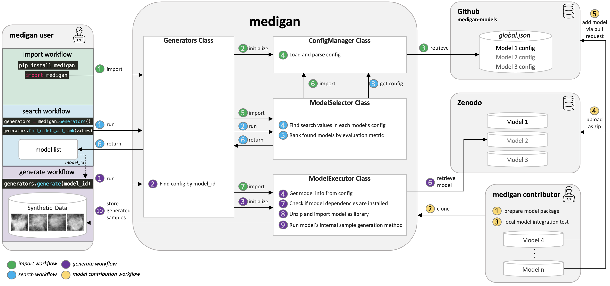

Welcome to medigan's documentation!
===================================

   Architectural overview including main workflows consisting of (a) library import and initialisation, (b) generative model search and ranking, (c) sample generation, and (d) generative model contribution.

.. automodule:: medigan.__init__
    :members:

.. automodule:: medigan.generators
    :members:

.. automodule:: medigan.config_manager
    :members:

.. automodule:: medigan.model_selector
    :members:

.. automodule:: medigan.model_executor
    :members:

.. automodule:: medigan.model_match_candidate
    :members:

.. automodule:: medigan.matched_entry
    :members:

.. automodule:: medigan.utils
    :members:

.. automodule:: medigan.constants
    :members:

.. toctree::
   :maxdepth: 2
   :caption: Contents:

Indices and tables
==================
* :ref:`genindex`
* :ref:`modindex`
* :ref:`search`