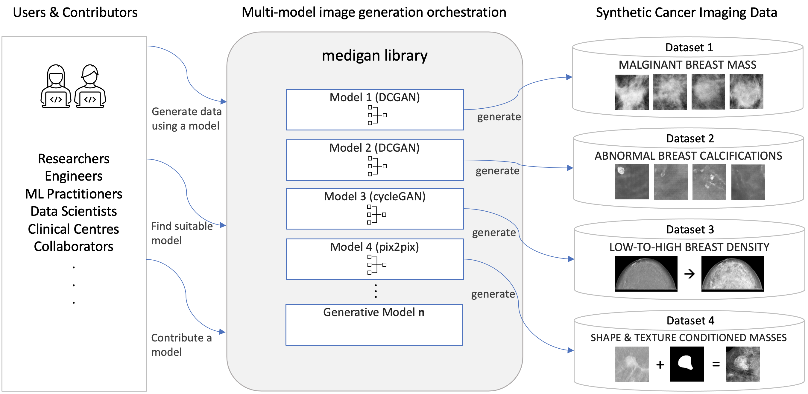

Getting started
=========================
Let's install `medigan` and generate a few synthetic images.

.. code-block:: Python

    pip install medigan

.. code-block:: Python

    from medigan import Generators
    Generators.generate(model_id="00001_DCGAN_MMG_CALC_ROI")

Overview
===================

   Overview of `medigan` users, library, and models on the example of mammography cancer image dataset generation.

.. toctree::
   :caption: Description
   :maxdepth: 3

   description

.. toctree::
   :caption: Code Examples
   :maxdepth: 3

   code_examples

.. toctree::
   :caption: Code
   :maxdepth: 2

   modules_overview
   code_doc

.. toctree::
   :caption: Tests
   :maxdepth: 5

   tests

.. toctree::
   :caption: Models
   :maxdepth: 3

   models

.. toctree::
   :caption: Add Your Model
   :maxdepth: 3

   adding_models

Indices
=======
* :ref:`genindex`
* :ref:`modindex`
* :ref:`search`