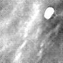
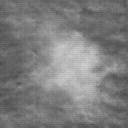
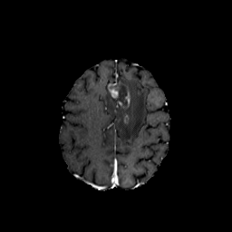
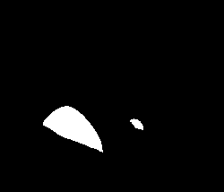

## 00001_DCGAN_MMG_CALC_ROI

DCGAN Model for Mammogram Calcification Region of Interest Generation (Trained on INbreast).  \
<sub> **Note:** A deep convolutional generative adversarial network (DCGAN) that generates regions of interest (ROI) of mammograms containing benign and/or malignant calcifications. Pixel dimensions are 128x128. The DCGAN was trained on ROIs from the INbreast dataset (Moreira et al, 2012). The uploaded ZIP file contains the files dcgan.pt (model weights), __init__.py (image generation method and utils), a README.md, and the GAN model architecture (in pytorch) below the /src folder. Kernel size=6 used in DCGAN discriminator. </sub>


| Output type                     |  Modality   |      Model type     |   Output size    |  Base dataset   |     Output examples       |    `model_id`      |  Hosted on   |  Reference  |
|-----------------------------|:--------:|:-------------:|:--------:|:------------:|:------:|:------:|:------:|:------:|
|  Breast Calcification         |   mammography   |     dcgan      |  128x128  |   [Inbreast](https://www.academicradiology.org/article/S1076-6332(11)00451-X/fulltext)    |  |  `00001_DCGAN_MMG_CALC_ROI`  | [Zenodo (5187714)](https://doi.org/10.5281/zenodo.5187714)  | | 

```python
# create samples with this model
from medigan import Generators
Generators().generate(model_id="00001_DCGAN_MMG_CALC_ROI", image_size=128)

# model specific parameters
inputs= ["image_size: default=128, help=128 is the image size that works with the supplied checkpoint."]
```


## 00002_DCGAN_MMG_MASS_ROI

DCGAN Model for Mammogram Mass Region of Interest Generation (Trained on OPTIMAM)  \
<sub> **Note:** A deep convolutional generative adversarial network (DCGAN) that generates regions of interest (ROI) of mammograms containing benign and/or malignant masses. Pixel dimensions are 128x128. The DCGAN was trained on ROIs from the Optimam dataset (Halling-Brown et al, 2014). The uploaded ZIP file contains the files malign_mass_gen (model weights), and __init__.py (image generation method and pytorch GAN model architecture). Kernel size=6 used in DCGAN discriminator. </sub>


| Output type                     |  Modality   |      Model type     |   Output size    |  Base dataset   |     Output examples       |    `model_id`      |  Hosted on   |  Reference  |
|-----------------------------|:--------:|:-------------:|:--------:|:------------:|:------:|:------:|:------:|:------:|
|  Breast Mass                  |   mammography   |     dcgan      |  128x128  |    [Optimam](https://doi.org/10.48550/arXiv.2004.04742)    |  |  `00002_DCGAN_MMG_MASS_ROI`  | [Zenodo (5188557)](https://doi.org/10.5281/zenodo.5188557)  | [Alyafi et al (2019)](https://doi.org/10.48550/arXiv.1909.02062)  | 

```python
# create samples with this model
from medigan import Generators
Generators().generate(model_id="00002_DCGAN_MMG_MASS_ROI")

# model specific parameters
inputs= []
```

# 00003_CYCLEGAN_MMG_DENSITY_FULL

CycleGAN Model for Low-to-High Brest Density Mammograms Translation (Trained on BCDR)  \
<sub> **Note:** A cycle generative adversarial network (CycleGAN) that generates mammograms with high breast density from an original mammogram e.g. with low-breast density. The CycleGAN was trained using normal (without pathologies) digital mammograms from BCDR dataset (Lopez, M. G., et al. 2012). The uploaded ZIP file contains the files CycleGAN_high_density.pth (model weights), __init__.py (image generation method and utils) and the GAN model architecture (in pytorch) below the /src folder. </sub>


| Output type                     |  Modality   |      Model type     |   Output size    |  Base dataset   |     Output examples       |    `model_id`      |  Hosted on   |  Reference  |
|-----------------------------|:--------:|:-------------:|:--------:|:------------:|:------:|:------:|:------:|:------:|
|  Breast Density Transfer      |   mammography   |    cyclegan    | 1332x800  |     [BCDR](https://bcdr.eu/information/about)      |  |  `00003_CYCLEGAN_MMG_DENSITY_FULL`  | [Zenodo (5547263)](https://doi.org/10.5281/zenodo.5547263)  | | 

```python
# create samples with this model
from medigan import Generators
Generators().generate(
    model_id="00003_CYCLEGAN_MMG_DENSITY_FULL",
    input_path="models/00003_CYCLEGAN_MMG_DENSITY_FULL/images",
    image_size=[1332, 800],
    gpu_id=0,
)

# model specific parameters
inputs= [
    "input_path: default=models/00003_CYCLEGAN_MMG_DENSITY_FULL/images, help=the path to .png mammogram images that are translated from low to high breast density or vice versa",
    "image_size: default=[1332, 800], help=list with image height and width. Images are rescaled to these pixel dimensions.",
    "gpu_id: default=0, help=the gpu to run the model on.",
    "translate_all_images: default=False, help=flag to override num_samples in case the user wishes to translate all images in the specified input_path folder."
]
```

# 00004_PIX2PIX_MASKTOMASS_BREAST_MG_SYNTHESIS

Generates synthetic patches given a random mask tiled with texture patches extracted from real images (Trained on BCDR)  \
<sub> **Note:** Generates synthetic patches given a random mask tiled with texture patches extracted from real images. The texture patches should be extracted from within the mass an outside the mass of a real image. Hence, some real ROIs are required to start with and its ideal for data augmentation purposes for mass segmentation. </sub>


| Output type                     |  Modality   |      Model type     |   Output size    |  Base dataset   |     Output examples       |    `model_id`      |  Hosted on   |  Reference  |
|-----------------------------|:--------:|:-------------:|:--------:|:------------:|:------:|:------:|:------:|:------:|
|  Breast Mass with Mask        |   mammography   |    pix2pix     |  256x256  |     [BCDR](https://bcdr.eu/information/about)      |  <br>  |  `00004_PIX2PIX_MASKTOMASS_BREAST_MG_SYNTHESIS`  | [Zenodo (5554950)](https://doi.org/10.5281/zenodo.5554950)  |  | 

```python
# create samples with this model
from medigan import Generators
Generators().generate(
    model_id="00004_PIX2PIX_MASKTOMASS_BREAST_MG_SYNTHESIS",
    input_path="models/00004_PIX2PIX_MASKTOMASS_BREAST_MG_SYNTHESIS/images",
    image_size=[256, 256],
    patch_size=[32, 32],
    shapes=['oval', 'lobulated'],
    ssim_threshold=0.2,
    gpu_id=0,
)

# model specific parameters
inputs= [
    "input_path: default=models/00004_PIX2PIX_MASKTOMASS_BREAST_MG_SYNTHESIS/images help=inputs that are used in the pix2pix input image pool (e.g. for tiled image generation) ",
    "image_size: default=[256, 256] help=height and width of images.",
    "patch_size: default=[32, 32] help=height and width of patches (annotation size on image).",
    "shapes: default=['oval', 'lobulated'] help=the type of the mask curve shapes generated via bezier curves.",
    "ssim_threshold: default=0.2, help=the SSIM threshold that images must surpass to be output.",
    "gpu_id: default=0 help=the gpu to run the model.",
]
```


# 00005_DCGAN_MMG_MASS_ROI

DCGAN Model for Mammogram MASS Patch Generation (Trained on BCDR)  \
<sub> **Note:** A deep convolutional generative adversarial network (DCGAN) that generates mass patches of mammograms. Pixel dimensions are 128x128. The DCGAN was trained on MMG patches from the BCDR dataset (Lopez et al, 2012). The uploaded ZIP file contains the files 500.pt (model weight), __init__.py (image generation method and utils), a requirements.txt, and the GAN model architecture (in pytorch) below the /src folder. </sub>


| Output type                     |  Modality   |      Model type     |   Output size    |  Base dataset   |     Output examples       |    `model_id`      |  Hosted on   |  Reference  |
|-----------------------------|:--------:|:-------------:|:--------:|:------------:|:------:|:------:|:------:|:------:|
|  Breast Mass                  |   mammography   |     dcgan      |  128x128  |     [BCDR](https://bcdr.eu/information/about)      |  |  `00005_DCGAN_MMG_MASS_ROI`  | [Zenodo (6555188)](https://doi.org/10.5281/zenodo.6555188)  | [Szafranowska et al (2022)](https://doi.org/10.48550/arXiv.2203.04961)  | 

```python
# create samples with this model
from medigan import Generators
Generators().generate(model_id="00005_DCGAN_MMG_MASS_ROI")

# model specific parameters
inputs= []
```


# 00006_WGANGP_MMG_MASS_ROI

WGAN-GP Model for Mammogram MASS Patch Generation (Trained on BCDR)  \
<sub> **Note:** A wasserstein generative adversarial network with gradient penalty (WGAN-GP) that generates mass patches of mammograms. Pixel dimensions are 128x128. The DCGAN was trained on MMG patches from the BCDR dataset (Lopez et al, 2012). The uploaded ZIP file contains the files 10000.pt (model weight), __init__.py (image generation method and utils), a requirements.txt, and the GAN model architecture (in pytorch) below the /src folder. </sub>


| Output type                     |  Modality   |      Model type     |   Output size    |  Base dataset   |     Output examples       |    `model_id`      |  Hosted on   |  Reference  |
|-----------------------------|:--------:|:-------------:|:--------:|:------------:|:------:|:------:|:------:|:------:|
|  Breast Mass                  |   mammography   |    wgan-gp     |  128x128  |     [BCDR](https://bcdr.eu/information/about)      |  |  `00006_WGANGP_MMG_MASS_ROI`  | [Zenodo (6554713)](https://doi.org/10.5281/zenodo.6554713)  | [Szafranowska et al (2022)](https://doi.org/10.48550/arXiv.2203.04961)  | 

```python
# create samples with this model
from medigan import Generators
Generators().generate(model_id="00006_WGANGP_MMG_MASS_ROI")

# model specific parameters
inputs= []
```


# 00007_INPAINT_BRAIN_MRI

Tumor Inpainting Model for Generation of Flair, T1, T1c, T2 Brain MRI Images (Trained on BRATS) \
<sub> **Note:** A Generative adversarial network (GAN) for Inpainting tumors (based on concentric circle-based tumor grade masks) into multi-modal MRI images (Flair, T1, T1c, T2) with dimensions 256x256. Model was trained on BRATS MRI Dataset (Menze et al). For more information, see publication (https://doi.org/10.1002/mp.14701). Model comes with example input image folders. Apart from that, the uploaded ZIP file contains the model checkpoint files .pth (model weight), __init__.py (image generation method and utils), a requirements.txt, the MEDIGAN metadata.json. The proposed method synthesizes brain tumor images from normal brain images and concentric circles that are simplified tumor masks. The tumor masks are defined by complex features, such as grade, appearance, size, and location. Thus, these features of the tumor masks are condensed and simplified to concentric circles. In the proposed method, the user-defined concentric circles are converted to various tumor masks through deep neural networks. The normal brain images are masked by the tumor mask, and the masked region is inpainted with the tumor images synthesized by the deep neural networks. Also see original repository at: https://github.com/KSH0660/BrainTumor" </sub>


| Output type                     |  Modality   |      Model type     |   Output size    |  Base dataset   |     Output examples       |    `model_id`      |  Hosted on   |  Reference  |
|-----------------------------|:--------:|:-------------:|:--------:|:------------:|:------:|:------:|:------:|:------:|
|  Brain Tumors on Flair, T1, T1c, T2 with Masks   |   brain MRI   |    inpaint GAN     |  256x256  |     [BRATS 2018](https://wiki.cancerimagingarchive.net/pages/viewpage.action?pageId=37224922)      |  <br>  <br>  <br>  <br>  <br>  |  `00007_INPAINT_BRAIN_MRI`  |  [Zenodo (7041737)](https://doi.org/10.5281/zenodo.7041737)  | [Kim et al (2020)](https://doi.org/10.1002/mp.14701)  | 

```python
# create samples with this model
from medigan import Generators
Generators().generate(
    model_id="00007_INPAINT_BRAIN_MRI",
    image_size=256,
    num_inpaints_per_sample=2,
    randomize_input_image_order=True,
    F_img_path=None,
    T1_img_path=None,
    T1c_img_path=None,
    T2_img_path=None,
    add_variations_to_mask=True,
    x_center=130,
    y_center=130,
    radius_1=10,
    radius_2=15,
    radius_3=30,
)

# model specific parameters
inputs= [
    "image_size: default=256, help=the size if height and width of the generated images.",
    "num_inpaints_per_sample: default=2, help=the number of tumor inpaint images per MRI modality that is generated from the same input sample",
    "randomize_input_image_order: default=True, help=input image order is randomized. This helps to not exclude input images if batch generation is used.",
    "F_img_path: default=None, help=The path to the folder were the input Flair MRI images are stored.",
    "T1_img_path: default=None, help=The path to the folder were the input T1 MRI images are stored.",
    "T1c_img_path: default=None, help=The path to the folder were the input T1c MRI images are stored.",
    "T2_img_path: default=None, help=The path to the folder were the input T2 MRI images are stored.",
    "add_variations_to_mask: default=True, help=This slightly varies the values of x_center, y_center, radius_1, radius_2, radius_3. If True, the same segmentation masks is still used to generate each of the 4 modality images. This is recommended as it results in higher image diversity.",
    "x_center: default=130, help=the x coordinate of the concentric circle upon which the binary mask, the tumor grade mask, and, ultimately, the generated images are based.",
    "y_center: default=130, help=the y coordinate of the concentric circle upon which the binary mask, the tumor grade mask, and, ultimately, the generated images are based.",
    "radius_1: default=10, help=the radius of the first (inside second) of three concentric circles (necrotic and non-enhancing tumor) upon which the binary mask, the tumor grade mask, and, ultimately, the generated images are based.",
    "radius_2: default=15, help=the radius of the second (inside third) of three concentric circles (enhancing tumor) upon which the binary mask, the tumor grade mask, and, ultimately, the generated images are based.",
    "radius_3: default=30, help=the radius of the third of three concentric circles (edema) upon which the binary mask, the tumor grade mask, and, ultimately, the generated images are based."
]
```


# 00008_C-DCGAN_MMG_MASSES

Conditional DCGAN Model for Patch Generation of Mammogram Masses Conditioned on Biopsy Proven Malignancy Status (Trained on CBIS-DDSM)  \
<sub> **Note:** A class-conditional deep convolutional generative adversarial network that generates mass patches of mammograms that are conditioned to either be benign (1) or malignant (0). Pixel dimensions are 128x128. The Cond-DCGAN was trained on MMG patches from the CBIS-DDSM (Sawyer Lee et al, 2016). The uploaded ZIP file contains the files 1750.pt (model weight), __init__.py (image generation method and utils), a requirements.txt, a LICENSE file, the MEDIGAN metadata, the used GAN training config file, a test.sh file to run the model, and two folders with a few generated images. </sub>


| Output type                     |  Modality   |      Model type     |   Output size    |  Base dataset   |     Output examples       |    `model_id`      |  Hosted on   |  Reference  |
|-----------------------------|:--------:|:-------------:|:--------:|:------------:|:------:|:------:|:------:|:------:|
|  Breast Mass (Mal/Benign)     |   mammography   |    c-dcgan      |  128x128  |     [CBIS-DDSM](https://wiki.cancerimagingarchive.net/display/Public/CBIS-DDSM)      |  |  `00008_C-DCGAN_MMG_MASSES`  | [Zenodo (6647349)](https://doi.org/10.5281/zenodo.6647349)  | |  

```python
# create samples with this model
from medigan import Generators
Generators().generate(
    model_id="00008_C-DCGAN_MMG_MASSES",
    condition=None,
    z=None,
)

# model specific parameters
inputs= [
    "condition: default=None, help=Either 0, 1 or None. Condition indicates whether a generated mass is malignant (0) or benign (1). If None, a balanced set of malignant and benign tumor images is created.",
    "z: default=None, help=the input noise torch tensor for the generator. If None, this option is ignored (e.g. random input vector generation)"
]
```


# 00009_PGGAN_POLYP_PATCHES_W_MASKS

PGGAN Model for Patch Generation of Polyps with Corresponding Segmentation Masks (Trained on HyperKvasir) \
<sub> **Note:** A Progressively-growing generative adversarial network that generates a 4 dimensional output containing an RGB image (channels 1-3) and a segmentation mask (channel 4). The RGB images are images of polyps and the segmentation mask indicates the location and shape of the polyp on the image. Pixel dimensions are 256x256. The model was trained on gastrointestinal endoscopy imaging data from the HyperKvasir dataset by Borgli et al (2020, 'https://doi.org/10.1038/s41597-020-00622-y'). The uploaded ZIP file contains the files ProGAN_300000_g.model (model weight), __init__.py (image generation method and utils), a requirements.txt, a LICENSE file, the MEDIGAN metadata, the source code from the official repository ('https://github.com/vlbthambawita/singan-seg-polyp'), and a test.sh file to run the model, and a folder 'examples/' with a few generated images. </sub>


| Output type                     |  Modality   |      Model type     |   Output size    |  Base dataset   |     Output examples       |    `model_id`      |  Hosted on   |  Reference  |
|-----------------------------|:--------:|:-------------:|:--------:|:------------:|:------:|:------:|:------:|:------:|
|  Polyp with Mask              |   endoscopy   |    pggan    |  256x256  |     [HyperKvasir](https://osf.io/mh9sj/)      |  <br>  |  `00009_PGGAN_POLYP_PATCHES_W_MASKS`  | [Zenodo (6653743)](https://doi.org/10.5281/zenodo.6653743)  | [Thambawita et al (2022)](https://doi.org/10.1371/journal.pone.0267976)  | 

```python
# create samples with this model
Generators().generate(
    model_id="00009_PGGAN_POLYP_PATCHES_W_MASKS",
    gpu_id=None, 
    channel=128, 
    z_dim=128, 
    pixel_norm=False, 
    img_channels=4, 
    tanh=False, 
    step=6, 
    alpha=1, 
    save_option="image_only", 
    num_fakes=1000,
)

# model specific parameters
inputs=[
    "gpu_id: type=int, default=None, help=0 is the first gpu, 1 is the second gpu, etc.",
    "channel: type=int, default=128, help=determines how big the model is, smaller value means faster training, but less capacity of the model",
    "z_dim: type=int, default=128, help=the initial latent vectors dimension, can be smaller such as 64, if the dataset is not diverse",
    "pixel_norm: default=False, action=store_true, help=a normalization method inside the model, you can try use it or not depends on the dataset",
    "img_channels: default=4, help=Number of channels in input data., for rgb images=3, gray=1 etc.",
    "tanh: default=False, action=store_true, help=an output non-linearity on the output of Generator, you can try use it or not depends on the dataset",
    "step: default=6, help=step to generate fake data. # can be 1 = 8, 2 = 16, 3 = 32, 4 = 64, 5 = 128, 6 = 256",
    "alpha: default=1, help=Progressive gan parameter to set, 0 or 1",
    "save_option: default=image_only, help=Options to save output, image_only, mask_only, image_and_mask, choices=[image_only,mask_only, image_and_mask]",
    "num_fakes: default=1000, help=Number of fakes to generate, type=int"
]
```


# 00010_FASTGAN_POLYP_PATCHES_W_MASKS

FastGAN Model for Patch Generation of Polyps with Corresponding Segmentation Masks (Trained on HyperKvasir) \
<sub> **Note:** A Fast generative adversarial network (FastGAN) that generates a 4 dimensional output containing an RGB image (channels 1-3) and a segmentation mask (channel 4). FASTGAN is from the paper 'Towards Faster and Stabilized GAN Training for High-fidelity Few-shot Image Synthesis' in ICLR 2021. The RGB images are images of polyps and the segmentation mask indicates the location and shape of the polyp on the image. Pixel dimensions are 256x256. The model was trained on gastrointestinal endoscopy imaging data from the HyperKvasir dataset by Borgli et al (2020, 'https://doi.org/10.1038/s41597-020-00622-y'). The uploaded ZIP file contains the files FastGAN_all_50000.pth (model weight), __init__.py (image generation method and utils), a requirements.txt, a LICENSE file, the MEDIGAN metadata, the source code from the repository ('https://github.com/vlbthambawita/singan-seg-polyp'), and a test.sh file to run the model, and a folder 'examples/' with a few generated images. </sub>


| Output type                     |  Modality   |      Model type     |   Output size    |  Base dataset   |     Output examples       |    `model_id`      |  Hosted on   |  Reference  |
|-----------------------------|:--------:|:-------------:|:--------:|:------------:|:------:|:------:|:------:|:------:|
|  Polyp with Mask              |   endoscopy   |    fastgan  |  256x256  |     [HyperKvasir](https://osf.io/mh9sj/)      |  <br>  |  `00010_FASTGAN_POLYP_PATCHES_W_MASKS`  | [Zenodo (6660711)](https://doi.org/10.5281/zenodo.6660711)  | [Thambawita et al (2022)](https://doi.org/10.1371/journal.pone.0267976)  | 

```python
# create samples with this model
from medigan import Generators
Generators().generate(
    model_id="00010_FASTGAN_POLYP_PATCHES_W_MASKS",
    gpu_id=None, 
    save_option="image_and_mask",
)

# model specific parameters
inputs=[
    "gpu_id: type=int, default=None, help=0 is the first gpu, 1 is the second gpu, etc.",
    "save_option: default=image_only, help=Options to save output, image_only, mask_only, image_and_mask, choices=[image_only,mask_only, image_and_mask]"
]
```


# 00011_SINGAN_POLYP_PATCHES_W_MASKS

SinGAN Model for Patch Generation of Polyps with Corresponding Segmentation Masks (Trained on HyperKvasir) \
<sub> **Note:** A SinGAN generative adversarial network that generates a 2dimensional output image tuple containing a 3-channel RGB image and a 3-channel segmentation mask. SinGAN is from the paper 'SinGAN: Learning a Generative Model from a Single Natural Image' in ICCV 2019. The width of the outputted images varies depending on the corresponding original image. The RGB images are images of polyps and the segmentation mask indicates the location and shape of the polyp on the image. Pixel dimensions are 213x256. The model was trained on gastrointestinal endoscopy imaging data from the HyperKvasir dataset by Borgli et al (2020, 'https://doi.org/10.1038/s41597-020-00622-y'). The uploaded ZIP file contains the checkpoints in folder 'SinGAN-Generated' (model weights), __init__.py (image generation method and utils), a requirements.txt, a LICENSE file, the MEDIGAN metadata, the source code from the repository ('https://github.com/vlbthambawita/singan-seg-polyp'), and a test.sh file to run the model, and a folder 'examples/' with a few generated images. </sub>


| Output type                     |  Modality   |      Model type     |   Output size    |  Base dataset   |     Output examples       |    `model_id`      |  Hosted on   |  Reference  |
|-----------------------------|:--------:|:-------------:|:--------:|:------------:|:------:|:------:|:------:|:------:|
|  Polyp with Mask              |   endoscopy   |    singan  |  ≈250x250  |     [HyperKvasir](https://osf.io/mh9sj/)      |  <br>  |  `00011_SINGAN_POLYP_PATCHES_W_MASKS`  | [Zenodo (6667944)](https://doi.org/10.5281/zenodo.6667944)  | [Thambawita et al (2022)](https://doi.org/10.1371/journal.pone.0267976)  | 

```python
# create samples with this model
from medigan import Generators
Generators().generate(
    model_id="00011_SINGAN_POLYP_PATCHES_W_MASKS",
    model_files="models/00011_SINGAN_POLYP_PATCHES_W_MASKS/singan_seg_polyp/SinGAN-Generated",
    gen_start_scale=0,
    checkpoint_ids=None,
    multiple_checkpoints=False
)

# model specific parameters
inputs= [
    "model_files: default=models/00011_SINGAN_POLYP_PATCHES_W_MASKS/singan_seg_polyp/SinGAN-Generated help=the folder where the checkpoints are stored | ",
    "gen_start_scale: default=0 help=The start for scaling (progressively increasing generator input size) in SinGAN.",
    "checkpoint_ids: default=None help=A list of checkpoint ids that will be used for polyp generation. If None, all available checkpoints (i.e. 1000) or one random one (depending on 'multiple_checkpoints' arg) will be used.",
    "multiple_checkpoints: default=False help=A boolean indicating if all checkpoint_ids or one random one is used for generating images, but only in case 'checkpoint_ids'==None"
]
```


# 00012_C-DCGAN_MMG_MASSES

Conditional DCGAN Model for Patch Generation of Mammogram Masses Conditioned on Biopsy Proven Malignancy Status (Trained on BCDR) \
<sub> **Note:** A class-conditional deep convolutional generative adversarial network that generates mass patches of mammograms that are conditioned to either be benign (1) or malignant (0). Pixel dimensions are 128x128. The Cond-DCGAN was trained on MMG patches from the BCDR dataset (Lopez et al, 2012). The uploaded ZIP file contains the files 1250.pt (model weight), __init__.py (image generation method and utils), a requirements.txt, a LICENSE file, the MEDIGAN metadata, the used GAN training config file, a test.sh file to run the model, and two folders with a few generated images. </sub>


| Output type                     |  Modality   |      Model type     |   Output size    |  Base dataset   |     Output examples       |    `model_id`      |  Hosted on   |  Reference  |
|-----------------------------|:--------:|:-------------:|:--------:|:------------:|:------:|:------:|:------:|:------:|
|  Breast Mass (Mal/Benign)     |   mammography   |    c-dcgan      |  128x128  |     [BCDR](https://bcdr.eu/information/about)      |  |  `00012_C-DCGAN_MMG_MASSES`  | [Zenodo (6755693)](https://doi.org/10.5281/zenodo.6818095)  | | 

```python
# create samples with this model
from medigan import Generators
Generators().generate(
    model_id="00012_C-DCGAN_MMG_MASSES",
    condition=None,
    z=None,
)

# model specific parameters
inputs= [
    "condition: default=None, help=Either 0, 1 or None. Condition indicates whether a generated mass is malignant (0) or benign (1). If None, a balanced set of malignant and benign tumor images is created.",
    "z: default=None, help=the input noise torch tensor for the generator. If None, this option is ignored (e.g. random input vector generation)"
]
```


# 00013_CYCLEGAN_MMG_DENSITY_OPTIMAM_MLO

CycleGAN Model for Low-to-High Brest Density Mammograms Translation of MLO VIEW (Trained on OPTIMAM) \
<sub> **Note:** A cycle generative adversarial network (CycleGAN) that generates mammograms with high breast density from an original mammogram e.g. with low-breast density. The CycleGAN was trained using normal (without pathologies) digital mammograms from OPTIMAM dataset (Halling-Brown et al, 2014). The uploaded ZIP file contains the files CycleGAN_high_density.pth (model weights), __init__.py (image generation method and utils) and the GAN model architecture (in pytorch) below the /src folder. </sub>


| Output type                     |  Modality   |      Model type     |   Output size    |  Base dataset   |     Output examples       |    `model_id`      |  Hosted on   |  Reference  |
|-----------------------------|:--------:|:-------------:|:--------:|:------------:|:------:|:------:|:------:|:------:|
|  Breast Density Transfer MLO  |   mammography   |    cyclegan    | 1332x800  |     [OPTIMAM](https://doi.org/10.48550/arXiv.2004.04742)      |  |  `00013_CYCLEGAN_MMG_DENSITY_OPTIMAM_MLO`  | [Zenodo (6818095)](https://doi.org/10.5281/zenodo.6818095)  | | 

```python
# create samples with this model
from medigan import Generators
Generators().generate(
    model_id="00013_CYCLEGAN_MMG_DENSITY_OPTIMAM_MLO",
    input_path="models/00013_CYCLEGAN_MMG_DENSITY_OPTIMAM_MLO/images", 
    image_size=[1332, 800], 
    gpu_id=0, 
    translate_all_images=False, 
    low_to_high=True,
)

# model specific parameters
inputs= [
    "input_path: default=models/00013_CYCLEGAN_MMG_DENSITY_OPTIMAM_MLO/images, help=the path to .png mammogram images that are translated from low to high breast density or vice versa",
    "image_size: default=[1332, 800], help=list with image height and width. Images are rescaled to these pixel dimensions.",
    "gpu_id: default=0, help=the gpu to run the model on.",
    "translate_all_images: default=False, help=flag to override num_samples in case the user wishes to translate all images in the specified input_path folder.",
    "low_to_high: default=True, help=if true, breast density is added. If false, it is removed from the input image. A different generator of the cycleGAN is used based no this flag."
]
```


# 00014_CYCLEGAN_MMG_DENSITY_OPTIMAM_CC

CycleGAN Model for Low-to-High Brest Density Mammograms Translation of CC VIEW (Trained on OPTIMAM) \
<sub> **Note:** A cycle generative adversarial network (CycleGAN) that generates mammograms with high breast density from an original mammogram e.g. with low-breast density. The CycleGAN was trained using normal (without pathologies) digital mammograms from OPTIMAM dataset (Halling-Brown et al, 2014). The uploaded ZIP file contains the files CycleGAN_high_density.pth (model weights), __init__.py (image generation method and utils) and the GAN model architecture (in pytorch) below the /src folder. </sub>

| Output type                     |  Modality   |      Model type     |   Output size    |  Base dataset   |     Output examples       |    `model_id`      |  Hosted on   |  Reference  |
|-----------------------------|:--------:|:-------------:|:--------:|:------------:|:------:|:------:|:------:|:------:|
|  Breast Density Transfer CC   |   mammography   |    cyclegan    | 1332x800  |     [OPTIMAM](https://doi.org/10.48550/arXiv.2004.04742)      |  |  `00014_CYCLEGAN_MMG_DENSITY_OPTIMAM_CC`  | [Zenodo (6818103)](https://doi.org/10.5281/zenodo.6818103)  | |  

```python
# create samples with this model
from medigan import Generators
Generators().generate(
    model_id="00014_CYCLEGAN_MMG_DENSITY_OPTIMAM_CC",
    input_path="models/00014_CYCLEGAN_MMG_DENSITY_OPTIMAM_CC/images", 
    image_size=[1332, 800], 
    gpu_id=0, 
    translate_all_images=False, 
    low_to_high=True,
)

# model specific parameters
inputs= [
    "input_path: default=models/00013_CYCLEGAN_MMG_DENSITY_OPTIMAM_MLO/images, help=the path to .png mammogram images that are translated from low to high breast density or vice versa",
    "image_size: default=[1332, 800], help=list with image height and width. Images are rescaled to these pixel dimensions.",
    "gpu_id: default=0, help=the gpu to run the model on.",
    "translate_all_images: default=False, help=flag to override num_samples in case the user wishes to translate all images in the specified input_path folder.",
    "low_to_high: default=True, help=if true, breast density is added. If false, it is removed from the input image. A different generator of the cycleGAN is used based no this flag."
]
```


# 00015_CYCLEGAN_MMG_DENSITY_CSAW_MLO

CycleGAN Model for Low-to-High Brest Density Mammograms Translation of MLO VIEW (Trained on CSAW) \
<sub> **Note:** A cycle generative adversarial network (CycleGAN) that generates mammograms with high breast density from an original mammogram e.g. with low-breast density. The CycleGAN was trained using normal (without pathologies) digital mammograms from CSAW dataset (Dembrower et al., 2020, https://doi.org/10.1007/s10278-019-00278-0). The uploaded ZIP file contains the files CycleGAN_high_density.pth (model weights), __init__.py (image generation method and utils) and the GAN model architecture (in pytorch) below the /src folder. </sub>

| Output type                     |  Modality   |      Model type     |   Output size    |  Base dataset   |     Output examples       |    `model_id`      |  Hosted on   |  Reference  |
|-----------------------------|:--------:|:-------------:|:--------:|:------------:|:------:|:------:|:------:|:------:|
|  Breast Density Transfer MLO  |   mammography   |    cyclegan    | 1332x800  |     [CSAW](https://link.springer.com/article/10.1007/s10278-019-00278-0)      |  |  `00015_CYCLEGAN_MMG_DENSITY_CSAW_MLO`  | [Zenodo (6818105)](https://doi.org/10.5281/zenodo.6818105)  | |  

```python
# create samples with this model
from medigan import Generators
Generators().generate(
    model_id="00015_CYCLEGAN_MMG_DENSITY_CSAW_MLO",
    input_path="models/00015_CYCLEGAN_MMG_DENSITY_CSAW_MLO/images", 
    image_size=[1332, 800], 
    gpu_id=0, 
    translate_all_images=False, 
    low_to_high=True,
)

# model specific parameters
inputs= [
    "input_path: default=models/00013_CYCLEGAN_MMG_DENSITY_OPTIMAM_MLO/images, help=the path to .png mammogram images that are translated from low to high breast density or vice versa",
    "image_size: default=[1332, 800], help=list with image height and width. Images are rescaled to these pixel dimensions.",
    "gpu_id: default=0, help=the gpu to run the model on.",
    "translate_all_images: default=False, help=flag to override num_samples in case the user wishes to translate all images in the specified input_path folder.",
    "low_to_high: default=True, help=if true, breast density is added. If false, it is removed from the input image. A different generator of the cycleGAN is used based no this flag."
]
```


# 00016_CYCLEGAN_MMG_DENSITY_CSAW_CC

CycleGAN Model for Low-to-High Brest Density Mammograms Translation of CC VIEW (Trained on CSAW) \
<sub> **Note:** A cycle generative adversarial network (CycleGAN) that generates mammograms with high breast density from an original mammogram e.g. with low-breast density. The CycleGAN was trained using normal (without pathologies) digital mammograms from CSAW dataset (Dembrower et al., 2020, https://doi.org/10.1007/s10278-019-00278-0). The uploaded ZIP file contains the files CycleGAN_high_density.pth (model weights), __init__.py (image generation method and utils) and the GAN model architecture (in pytorch) below the /src folder. </sub>

| Output type                     |  Modality   |      Model type     |   Output size    |  Base dataset   |     Output examples       |    `model_id`      |  Hosted on   |  Reference  |
|-----------------------------|:--------:|:-------------:|:--------:|:------------:|:------:|:------:|:------:|:------:|
|  Breast Density Transfer CC   |   mammography   |    cyclegan    | 1332x800  |     [CSAW](https://link.springer.com/article/10.1007/s10278-019-00278-0)     |  |  `00016_CYCLEGAN_MMG_DENSITY_CSAW_CC`  | [Zenodo (6818107)](https://doi.org/10.5281/zenodo.6818107)  | | 

```python
# create samples with this model
from medigan import Generators
Generators().generate(
    model_id="00016_CYCLEGAN_MMG_DENSITY_CSAW_CC",
    input_path="models/00016_CYCLEGAN_MMG_DENSITY_CSAW_CC/images", 
    image_size=[1332, 800], 
    gpu_id=0, 
    translate_all_images=False, 
    low_to_high=True,
)

# model specific parameters
inputs= [
    "input_path: default=models/00013_CYCLEGAN_MMG_DENSITY_OPTIMAM_MLO/images, help=the path to .png mammogram images that are translated from low to high breast density or vice versa",
    "image_size: default=[1332, 800], help=list with image height and width. Images are rescaled to these pixel dimensions.",
    "gpu_id: default=0, help=the gpu to run the model on.",
    "translate_all_images: default=False, help=flag to override num_samples in case the user wishes to translate all images in the specified input_path folder.",
    "low_to_high: default=True, help=if true, breast density is added. If false, it is removed from the input image. A different generator of the cycleGAN is used based no this flag."
]
```


# 00017_DCGAN_XRAY_LUNG_NODULES

DCGAN Model for Patch Generation of Lung Nodules (Trained on Node21) \
<sub> **Note:** An unconditional deep convolutional generative adversarial network (DCGAN) that generates lung nodule regions-of-interest patches based on chest xray (CXR) images. The pixel dimension of the generated patches is 128x128. The WGANGP was trained on cropped patches from CXR images from the NODE21 dataset (Sogancioglu et al, 2021). The uploaded ZIP file contains the files model.pt (model weight), __init__.py (image generation method and utils), a requirements.txt, a LICENSE file, the MEDIGAN metadata.json file, the used GAN training config file, a test.sh file to run the model, and an /image folder with a few generated example images. </sub>

| Output type                     |  Modality   |      Model type     |   Output size    |  Base dataset   |     Output examples       |    `model_id`      |  Hosted on   |  Reference  |
|-----------------------------|:--------:|:-------------:|:--------:|:------------:|:------:|:------:|:------:|:------:|
|  Lung Nodules                 |   chest x-ray   |    dcgan       | 128x128   |     [NODE21](https://zenodo.org/record/4725881#.YxNmNuxBwXA)      |  |  `00017_DCGAN_XRAY_LUNG_NODULES`  | [Zenodo (6943691)](https://doi.org/10.5281/zenodo.6943691)  | | 

```python
# create samples with this model
from medigan import Generators
Generators().generate(model_id="00017_DCGAN_XRAY_LUNG_NODULES")

# model specific parameters
inputs= []
```


# 00018_WGANGP_XRAY_LUNG_NODULES

WGANGP Model for Patch Generation of Lung Nodules (Trained on Node21) \
<sub> **Note:** An unconditional wasserstein generative adversarial network with gradient penalty (WGAN_GP) that generates lung nodule regions-of-interest patches based on chest xray (CXR) images. The pixel dimension of the generated patches is 128x128. The WGANGP was trained on cropped patches from CXR images from the NODE21 dataset (Sogancioglu et al, 2021). The uploaded ZIP file contains the files model.pt (model weight), __init__.py (image generation method and utils), a requirements.txt, a LICENSE file, the MEDIGAN metadata.json file, the used GAN training config file, a test.sh file to run the model, and an /image folder with a few generated example images. </sub>

| Output type                     |  Modality   |      Model type     |   Output size    |  Base dataset   |     Output examples       |    `model_id`      |  Hosted on   |  Reference  |
|-----------------------------|:--------:|:-------------:|:--------:|:------------:|:------:|:------:|:------:|:------:|
|  Lung Nodules                 |   chest x-ray   |    wgan-gp       | 128x128   |     [NODE21](https://zenodo.org/record/4725881#.YxNmNuxBwXA)      |  |  `00018_WGANGP_XRAY_LUNG_NODULES`  | [Zenodo (6943761)](https://doi.org/10.5281/zenodo.6943761)  | | 

```python
# create samples with this model
from medigan import Generators
Generators().generate(model_id="00018_WGANGP_XRAY_LUNG_NODULES")

# model specific parameters
inputs= []
```


# 00019_PGGAN_CHEST_XRAY

PGGAN Model for Generation of Chest XRAY (CXR) Images (Trained on Node21) \
<sub> **Note:** An unconditional Progressively-growing generative adversarial network (PGGAN) that generates chest xray (CXR) images with pixel dimensions 1024x1024. The PGGAN was trained on CXR images from the NODE21 dataset (Sogancioglu et al, 2021). The uploaded ZIP file contains the files model.pt (model weight), __init__.py (image generation method and utils), a requirements.txt, a LICENSE file, the MEDIGAN metadata.json file, the used GAN training config file, a test.sh file to run the model, and an /image folder with a few generated example images. </sub>

| Output type                     |  Modality   |      Model type     |   Output size    |  Base dataset   |     Output examples       |    `model_id`      |  Hosted on   |  Reference  |
|-----------------------------|:--------:|:-------------:|:--------:|:------------:|:------:|:------:|:------:|:------:|
|  Chest Xray Images            |   chest x-ray   |    pggan       | 1024x1024   |     [NODE21](https://zenodo.org/record/4725881#.YxNmNuxBwXA)      |  |  `00019_PGGAN_CHEST_XRAY`  | [Zenodo (6943803)](https://doi.org/10.5281/zenodo.6943803)  | | 

```python
# create samples with this model
from medigan import Generators
Generators().generate(model_id="00019_PGGAN_CHEST_XRAY")

# model specific parameters
inputs= []
```


# 00020_PGGAN_CHEST_XRAY

PGGAN Model for Generation of Chest XRAY (CXR) Images (Trained on ChestX-ray14 Dataset) \
<sub> **Note:** An unconditional Progressively-growing generative adversarial network (PGGAN) that generates chest xray (CXR) images with pixel dimensions 1024x1024. The PGGAN was trained on CXR images based on ChestX-ray14 dataset (Wang et al. 2017, Paper: https://arxiv.org/pdf/1705.02315.pdf, Data: https://nihcc.app.box.com/v/ChestXray-NIHCC). The uploaded ZIP file contains the model weights checkpoint file, __init__.py (image generation method and utils), a requirements.txt, the MEDIGAN metadata.json file, a test.sh file to run the model, and an /image folder with a few generated example images. </sub>

| Output type                     |  Modality   |      Model type     |   Output size    |  Base dataset   |     Output examples       |    `model_id`      |  Hosted on   |  Reference  |
|-----------------------------|:--------:|:-------------:|:--------:|:------------:|:------:|:------:|:------:|:------:|
|  Chest Xray Images            |   chest x-ray   |    pggan       | 1024x1024   |     [ChestX-ray14](https://nihcc.app.box.com/v/ChestXray-NIHCC/folder/36938765345)      |  |  `00020_PGGAN_CHEST_XRAY`  | [Zenodo (7046280)](https://doi.org/10.5281/zenodo.7046280)  |  [Segal et al (2021)](https://doi.org/10.1007/s42979-021-00720-7)  |

```python
# create samples with this model
from medigan import Generators
Generators().generate(
    model_id="00020_PGGAN_CHEST_XRAY",
    image_size=1024,
    resize_pixel_dim=None,
)

# model specific parameters
inputs = [
    "image_size: default=1024, help=the size if height and width of the generated images",
    "resize_pixel_dim: default=None, help=Resizing of generated images via the pillow PIL image library."
]
```


# 00021_CYCLEGAN_Brain_MRI_T1_T2

CycleGAN Brain MRI T1-T2 translation (trained on CrossMoDA 2021 dataset)

<sub> **Note:** In recent years, deep learning models have considerably advanced the performance of segmentation tasks on Brain Magnetic Resonance Imaging (MRI). However, these models show a considerable performance drop when they are evaluated on unseen data from a different distribution. Since annotation is often a hard and costly task requiring expert supervision, it is necessary to develop ways in which existing models can be adapted to the unseen domains without any additional labelled information. In this work, we explore one such technique which extends the CycleGAN [2] architecture to generate label-preserving data in the target domain. The synthetic target domain data is used to train the nn-UNet [3] framework for the task of multi-label segmentation. The experiments are conducted and evaluated on the dataset [1] provided in the ‘Cross-Modality Domain Adaptation for Medical Image Segmentation’ challenge [23] for segmentation of vestibular schwannoma (VS) tumour and cochlea on contrast enhanced (ceT1) and high resolution (hrT2) MRI scans. In the proposed approach, our model obtains dice scores (DSC) 0.73 and 0.49 for tumour and cochlea respectively on the validation set of the dataset. This indicates the applicability of the proposed technique to real-world problems where data may be obtained by different acquisition protocols as in [1] where hrT2 images are more reliable, safer, and lower-cost alternative to ceT1. </sub>


| Output type                     |  Modality   |      Model type     |   Output size    |  Base dataset   |     Output examples       |    `model_id`      |  Hosted on   |  Reference  |
|-----------------------------|:--------:|:-------------:|:--------:|:------------:|:------:|:------:|:------:|:------:|
| Brain T1-T2 MRI Modality Transfer |  brain MRI  |   cyclegan      | 224x192  |    [CrossMoDA 2021](https://arxiv.org/abs/2201.02831)     |  | `00021_CYCLEGAN_Brain_MRI_T1_T2` | [Zenodo (7074555)](https://doi.org/10.5281/zenodo.7074555) | [Joshi et al (2022)](https://doi.org/10.1007/978-3-031-09002-8_47) |

```python
# create samples with this model
from medigan import Generators
Generators().generate(
    model_id="00021_CYCLEGAN_Brain_MRI_T1_T2",
    input_path= "models/00021_CYCLEGAN_Brain_MRI_T1_T2/inputs/T1", # or /T2
    image_size=[224, 192],
    gpu_id=0,
    translate_all_images=True,
    T1_to_T2=True,
)

# model specific parameters
inputs = [
    "input_path: default=models/00021_CYCLEGAN_Brain_MRI_T1_T2/inputs/T1, help=the path to .png brain MRI images that are translated from T1 to T2 or vice versa. ",
    "image_size: default=[224, 192], help=list with image height and width. ",
    "gpu_id: default=0, help=the gpu to run the model on.",
    "translate_all_images: default=False, help=flag to override num_samples in case the user wishes to translate all images in the specified input_path folder.",
    "T1_to_T2: default=True, help=if true, generator for T1 to T2 translation is used. If false, the translation is done from T2 to T1 instead. Need to adjust input path in this case e.g. models/00021_CYCLEGAN_Brain_MRI_T1_T2/inputs/T2 instead of models/00021_CYCLEGAN_Brain_MRI_T1_T2/inputs/T1. A different generator of the cycleGAN is used based on this flag."
]
```