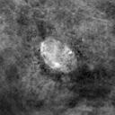
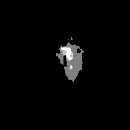
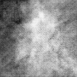
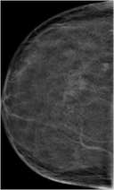
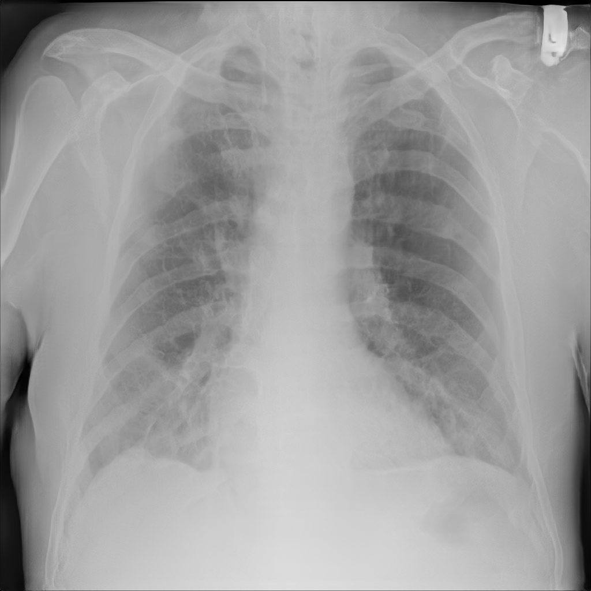

| Output type                     | Modality |      Model type    |   Output size   | Base dataset |     Output examples      |    `model_id`     |  Hosted on  |  Reference |
|-----------------------------|:--------:|:-------------:|:--------:|:------------:|:------:|:------:|:------:|:------:|
|  Breast Calcification         |   mammography   |     dcgan      |  128x128  |   [Inbreast](https://www.academicradiology.org/article/S1076-6332(11)00451-X/fulltext)    |  |  `00001_DCGAN_MMG_CALC_ROI`  | [Zenodo (5187714)](https://doi.org/10.5281/zenodo.5187714)  | | 
|  Breast Mass                  |   mammography   |     dcgan      |  128x128  |    [Optimam](https://doi.org/10.48550/arXiv.2004.04742)    |  |  `00002_DCGAN_MMG_MASS_ROI`  | [Zenodo (5188557)](https://doi.org/10.5281/zenodo.5188557)  | [Alyafi et al (2019)](https://doi.org/10.48550/arXiv.1909.02062)  | 
|  Breast Density Transfer      |   mammography   |    cyclegan    | 1332x800  |     [BCDR](https://bcdr.eu/information/about)      |  |  `00003_CYCLEGAN_MMG_DENSITY_FULL`  | [Zenodo (5547263)](https://doi.org/10.5281/zenodo.5547263)  | | 
|  Breast Mass with Mask        |   mammography   |    pix2pix     |  256x256  |     [BCDR](https://bcdr.eu/information/about)      |     |  `00004_PIX2PIX_MASKTOMASS_BREAST_MG_SYNTHESIS`  | [Zenodo (5554950)](https://doi.org/10.5281/zenodo.5554950)  |  | 
|  Breast Mass                  |   mammography   |     dcgan      |  128x128  |     [BCDR](https://bcdr.eu/information/about)      |  |  `00005_DCGAN_MMG_MASS_ROI`  | [Zenodo (6555188)](https://doi.org/10.5281/zenodo.6555188)  | [Szafranowska et al (2022)](https://doi.org/10.48550/arXiv.2203.04961)  | 
|  Breast Mass                  |   mammography   |    wgan-gp     |  128x128  |     [BCDR](https://bcdr.eu/information/about)      |  |  `00006_WGANGP_MMG_MASS_ROI`  | [Zenodo (6554713)](https://doi.org/10.5281/zenodo.6554713)  | [Szafranowska et al (2022)](https://doi.org/10.48550/arXiv.2203.04961)  | 
|  Brain Tumors on Flair, T1, T1c, T2 with Masks   |   brain MRI   |    inpaint GAN     |  256x256  |     [BRATS 2018](https://wiki.cancerimagingarchive.net/pages/viewpage.action?pageId=37224922)      |                 |  `00007_INPAINT_BRAIN_MRI`  |  [Zenodo (7041737)](https://doi.org/10.5281/zenodo.7041737)  | [Kim et al (2020)](https://doi.org/10.1002/mp.14701)  | 
|  Breast Mass (Mal/Benign)     |   mammography   |    c-dcgan      |  128x128  |     [CBIS-DDSM](https://wiki.cancerimagingarchive.net/display/Public/CBIS-DDSM)      |  |  `00008_C-DCGAN_MMG_MASSES`  | [Zenodo (6647349)](https://doi.org/10.5281/zenodo.6647349)  | |  
|  Polyp with Mask              |   endoscopy   |    pggan    |  256x256  |     [HyperKvasir](https://osf.io/mh9sj/)      |     |  `00009_PGGAN_POLYP_PATCHES_W_MASKS`  | [Zenodo (6653743)](https://doi.org/10.5281/zenodo.6653743)  | [Thambawita et al (2022)](https://doi.org/10.1371/journal.pone.0267976)  | 
|  Polyp with Mask              |   endoscopy   |    fastgan  |  256x256  |     [HyperKvasir](https://osf.io/mh9sj/)      |     |  `00010_FASTGAN_POLYP_PATCHES_W_MASKS`  | [Zenodo (6660711)](https://doi.org/10.5281/zenodo.6660711)  | [Thambawita et al (2022)](https://doi.org/10.1371/journal.pone.0267976)  | 
|  Polyp with Mask              |   endoscopy   |    singan  |  ≈250x250  |     [HyperKvasir](https://osf.io/mh9sj/)      |     |  `00011_SINGAN_POLYP_PATCHES_W_MASKS`  | [Zenodo (6667944)](https://doi.org/10.5281/zenodo.6667944)  | [Thambawita et al (2022)](https://doi.org/10.1371/journal.pone.0267976)  | 
|  Breast Mass (Mal/Benign)     |   mammography   |    c-dcgan      |  128x128  |     [BCDR](https://bcdr.eu/information/about)      |  |  `00012_C-DCGAN_MMG_MASSES`  | [Zenodo (6755693)](https://doi.org/10.5281/zenodo.6818095)  | | 
|  Breast Density Transfer MLO  |   mammography   |    cyclegan    | 1332x800  |     [OPTIMAM](https://doi.org/10.48550/arXiv.2004.04742)      |  |  `00013_CYCLEGAN_MMG_DENSITY_OPTIMAM_MLO`  | [Zenodo (6818095)](https://doi.org/10.5281/zenodo.6818095)  | | 
|  Breast Density Transfer CC   |   mammography   |    cyclegan    | 1332x800  |     [OPTIMAM](https://doi.org/10.48550/arXiv.2004.04742)      |  |  `00014_CYCLEGAN_MMG_DENSITY_OPTIMAM_CC`  | [Zenodo (6818103)](https://doi.org/10.5281/zenodo.6818103)  | |  
|  Breast Density Transfer MLO  |   mammography   |    cyclegan    | 1332x800  |     [CSAW](https://link.springer.com/article/10.1007/s10278-019-00278-0)      |  |  `00015_CYCLEGAN_MMG_DENSITY_CSAW_MLO`  | [Zenodo (6818105)](https://doi.org/10.5281/zenodo.6818105)  | |  
|  Breast Density Transfer CC   |   mammography   |    cyclegan    | 1332x800  |     [CSAW](https://link.springer.com/article/10.1007/s10278-019-00278-0)     |  |  `00016_CYCLEGAN_MMG_DENSITY_CSAW_CC`  | [Zenodo (6818107)](https://doi.org/10.5281/zenodo.6818107)  | | 
|  Lung Nodules                 |   chest x-ray   |    dcgan       | 128x128   |     [NODE21](https://zenodo.org/record/4725881#.YxNmNuxBwXA)      |  |  `00017_DCGAN_XRAY_LUNG_NODULES`  | [Zenodo (6943691)](https://doi.org/10.5281/zenodo.6943691)  | | 
|  Lung Nodules                 |   chest x-ray   |    wgan-gp       | 128x128   |     [NODE21](https://zenodo.org/record/4725881#.YxNmNuxBwXA)      |  |  `00018_WGANGP_XRAY_LUNG_NODULES`  | [Zenodo (6943761)](https://doi.org/10.5281/zenodo.6943761)  | | 
|  Chest Xray Images            |   chest x-ray   |    pggan       | 1024x1024   |     [NODE21](https://zenodo.org/record/4725881#.YxNmNuxBwXA)      |  |  `00019_PGGAN_CHEST_XRAY`  | [Zenodo (6943803)](https://doi.org/10.5281/zenodo.6943803)  | | 
|  Chest Xray Images            |   chest x-ray   |    pggan       | 1024x1024   |     [ChestX-ray14](https://nihcc.app.box.com/v/ChestXray-NIHCC/folder/36938765345)      |  |  `00020_PGGAN_CHEST_XRAY`  | [Zenodo (7046280)](https://doi.org/10.5281/zenodo.7046280)  |  [Segal et al (2021)](https://doi.org/10.1007/s42979-021-00720-7)  |

More model information can be found in the [global.json](https://github.com/RichardObi/medigan/blob/main/config/global.json) model metadata file.